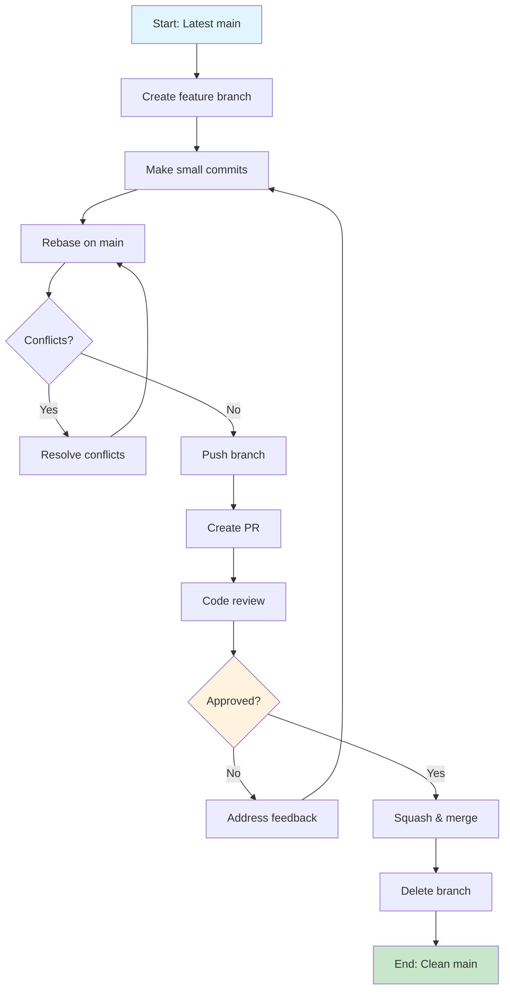

# GitHub Copilot Instructions

# <!--

# COPILOT INSTRUCTIONS FILE - DESIGN DOCUMENTATION

FILE PURPOSE: Provides comprehensive, unambiguous instructions for AI assistants
AUDIENCE: Primarily GitHub Copilot, but applicable to all AI coding assistants
DESIGN PHILOSOPHY: Maximum clarity and enforceability through multiple reinforcement techniques

REINFORCEMENT STRATEGY OVERVIEW:

1. XML SEMANTIC TAGS: Machine-parseable blocks for critical requirements
   - <CRITICAL_REQUIREMENT>, <WORKFLOW_ENFORCEMENT>, <NAMING_REQUIREMENTS>
   - <COMMIT_REQUIREMENTS>, <PROCESS_REQUIREMENTS>, <CODING_REQUIREMENTS>
2. VISUAL REINFORCEMENT: Multiple formatting techniques for human/AI recognition
   - **Bold** for critical concepts and section headers
   - ✅/❌ for positive/negative examples with immediate visual feedback
   - `Code blocks` for exact patterns, commands, and technical specifications
   - Numbered lists for sequential processes and procedures
3. STRUCTURAL REINFORCEMENT: Hierarchical organization for logical flow
   - Main sections with HTML comment documentation blocks
   - Subsections with specific focus areas and targeted instructions
   - Examples paired with counter-examples for clarity
   - Cross-references to related documentation files
4. BEHAVIORAL REINFORCEMENT: Explicit compliance mechanisms
   - "MUST", "MUST NOT", "SHOULD" imperative language
   - Specific numeric thresholds and measurable criteria
   - Process workflows with decision points and validation steps
   - Reference links to authoritative documentation sources

SECTION ORGANIZATION:

- Project Methodologies: Development workflow, branching, commits, PRs
- Coding Standards: Quality requirements, language standards, review processes
- Repository Overview: Context and supporting documentation structure

META-DOCUMENTATION: HTML comments before each section explain the instructional
design, reinforcement techniques, and compliance mechanisms for that section.
This creates a self-documenting system for understanding how AI instructions work.
==============================================================================
-->

**Audience:** Primarily GitHub Copilot. This file provides Copilot-specific instructions and configuration for this repository.

**Repository Context:**
This repository is a GitHub Template created by Capgemini's AI & Software Engineering team. It contains practical, portable, and useful examples of Copilot configuration for real-world projects.

**Copilot Guidance:**

- Follow the configuration and best practices outlined here when assisting in this repository.
- Reference `README.md` for general orientation and project goals.
- Reference `AGENTS.md` for broader AI agent instructions and context.

# <!--

# PROJECT METHODOLOGIES SECTION

PURPOSE: Establishes mandatory development workflow and branching strategies
SCOPE: Covers complete development lifecycle from branch creation to merge
REINFORCEMENT TECHNIQUES:

- XML blocks with semantic tags for critical requirements
- Hierarchical structure with clear categorization
- Specific numeric limits and timeframes for enforcement
- Visual workflow diagram for process comprehension
  COMPLIANCE MECHANISM: XML tags create parser-friendly enforcement points
  ==============================================================================
  -->

## Project Methodologies

<!--
BRANCHING STRATEGY SUBSECTION
PURPOSE: Define trunk-based development workflow with strict AI compliance
WHAT: Establishes mandatory short-lived feature branch requirements
HOW: Uses XML <CRITICAL_REQUIREMENT> tags to create non-negotiable rules
REINFORCEMENT TECHNIQUES:
1. XML semantic tags: <CRITICAL_REQUIREMENT type="MANDATORY">
2. Bold formatting for core principles
3. Numbered workflow steps for procedural clarity
4. <WORKFLOW_ENFORCEMENT> block with specific metrics
5. Bullet points for easy parsing and comprehension
DESIGN RATIONALE: AI assistants must recognize XML blocks as absolute requirements
-->

### Project Frameworks and Methodologies

The project implements React as a single-page checklist for assessing actions and requirements related to building secure software with AI assistance.

### Branching Strategy & Development Workflow

<CRITICAL_REQUIREMENT type="MANDATORY">

- AI assistants MUST follow trunk-based development with lightweight, short-lived feature branches. All changes MUST go through pull request review process.
- If using fish terminal AI assistants MUST NOT use heredoc syntax for commit messages or file contents due to incompatibility.
  </CRITICAL_REQUIREMENT>

**Core Principles:**

- **Trunk-based Development**: Work directly from `main` branch with short-lived feature branches (max 2-3 days)
- **Small, Frequent Commits**: Make numerous small commits rather than large, infrequent ones
- **Continuous Integration**: Every branch should be integration-ready and tested
- **Pull Request Mandatory**: ALL changes, no matter how small, MUST go through PR process

**Workflow Requirements:**

1. **Branch Creation**: Create feature branches from latest `main`
2. **Development**: Make small, focused commits with clear messages
3. **Integration**: Regularly rebase/merge from `main` to stay current
4. **Review**: Submit PR when feature/fix is complete
5. **Approval**: Obtain at least one approval before merging
6. **Cleanup**: Delete feature branch after successful merge

<WORKFLOW_ENFORCEMENT>

- Branch lifetime: Maximum 3 days from creation to merge
- Commit frequency: Minimum 1 commit per day of active work
- PR size: Target ≤ 400 lines of code changes per PR
- Review requirement: At least 1 human reviewer approval required
- Review turnaround: Initial review feedback target ≤ 1 business day for typical PRs
  </WORKFLOW_ENFORCEMENT>

<!--
NAMING CONVENTIONS SUBSECTION
PURPOSE: Enforce consistent branch and PR naming across all AI interactions
WHAT: Mandatory naming patterns with specific type prefixes and formats
HOW: XML <NAMING_REQUIREMENTS> with pattern examples and counter-examples
REINFORCEMENT TECHNIQUES:
1. XML enforcement tags for machine parsing
2. Code block syntax highlighting for patterns
3. Visual checkmarks (✅/❌) for immediate pattern recognition
4. Concrete examples with explanations
5. Clear mapping between branch names and PR titles
DESIGN RATIONALE: Pattern recognition through visual cues and strict typing
-->

### Branch and Pull Request Naming Conventions

<NAMING_REQUIREMENTS type="MANDATORY">
AI assistants MUST use these exact naming patterns for branches and pull requests.
</NAMING_REQUIREMENTS>

**Branch Naming Pattern:**

```
<type>/<brief-description>
```

**Required Types:**

- `feature/` - New features or enhancements
- `fix/` - Bug fixes and hotfixes
- `docs/` - Documentation updates
- `refactor/` - Code refactoring without functional changes
- `test/` - Test additions or modifications
- `chore/` - Maintenance tasks (dependencies, build scripts)
- `plan/` - Planning artifacts and proposals

**Examples:**

- ✅ `feature/add-user-authentication`
- ✅ `fix/resolve-login-timeout`
- ✅ `docs/update-api-documentation`
- ✅ `refactor/optimize-database-queries`
- ❌ `my-branch` (no type prefix)
- ❌ `feature/very-long-description-that-is-hard-to-read` (too verbose)

**Pull Request Naming:**

- PR titles MUST match branch name but use human-readable format
- Use imperative mood (same as commit messages)
- Examples:
  - Branch: `feature/add-user-authentication` → PR: "Add user authentication"
  - Branch: `fix/resolve-login-timeout` → PR: "Fix login timeout issue"

<!--
COMMIT MESSAGE CONVENTIONS SUBSECTION
PURPOSE: Standardize commit formatting for automated tooling and clarity
WHAT: Conventional commit specification with imperative mood requirements
HOW: XML <COMMIT_REQUIREMENTS> with format templates and validation rules
REINFORCEMENT TECHNIQUES:
1. Template-based format specification with placeholders
2. Imperative mood enforcement through bold text emphasis
3. Character limits for machine validation (50 char subject line)
4. Type categorization with semantic meaning
5. Multi-line examples showing complete commit structure
6. Negative examples with explicit rejection criteria
DESIGN RATIONALE: Structured format enables automation and consistent history
-->

### Commit Message Conventions

<COMMIT_REQUIREMENTS type="MANDATORY">
AI assistants MUST follow these commit message conventions for all commits.
</COMMIT_REQUIREMENTS>

**Format Requirements:**

```
<type>: <subject>

[optional body]

[optional footer]
```

**Subject Line Rules:**

- Use **imperative mood** ("Add feature" not "Added feature" or "Adds feature")
- Start with capital letter
- No period at the end
- Maximum 50 characters
- Be specific and descriptive

**Type Categories:**

- `feat:` - New features
- `fix:` - Bug fixes
- `docs:` - Documentation changes
- `style:` - Code style changes (formatting, semicolons, etc.)
- `refactor:` - Code refactoring without functionality changes
- `test:` - Adding or updating tests
- `chore:` - Maintenance tasks, dependency updates

**Examples:**

- ✅ `feat: Add user authentication with OAuth2`
- ✅ `fix: Resolve login timeout in production environment`
- ✅ `docs: Update API documentation for user endpoints`
- ✅ `refactor: Extract validation logic into utility functions`
- ❌ `Added new feature` (not imperative)
- ❌ `fix bug` (too vague)
- ❌ `Update stuff` (not descriptive)

**Body and Footer Guidelines:**

- Body: Explain **what** and **why**, not **how**
- Footer: Reference issues, breaking changes
- Example:

  ```
  feat: Add user authentication with OAuth2

  Implement OAuth2 authentication to replace legacy session-based auth.
  This improves security and enables SSO integration.

  Closes #123
  ```

<!--
BRANCH AND COMMIT PROCESS WORKFLOW SUBSECTION
PURPOSE: Define complete development lifecycle with visual process flow
WHAT: End-to-end workflow from branch creation to cleanup with decision points
HOW: XML <PROCESS_REQUIREMENTS> combined with Mermaid flowchart visualization
REINFORCEMENT TECHNIQUES:
1. Process requirement XML tags for mandatory compliance
2. Mermaid flowchart with conditional logic and decision points
3. Color-coded visual states (start=blue, end=green, decision=orange)
4. Sequential step numbering for pre-merge requirements
5. Bullet-point merge process rules for quick scanning
6. Visual and textual redundancy for dual-mode comprehension
DESIGN RATIONALE: Complex workflows need both textual rules and visual flow
-->

### Branch and Commit Process Workflow

<PROCESS_REQUIREMENTS type="MANDATORY">
AI assistants MUST follow this exact workflow for all code changes.
</PROCESS_REQUIREMENTS>

**Pre-Merge Requirements:**

1. **Rebase Strategy**: Always rebase feature branch on latest `main` before creating PR
2. **Commit Organization**: Squash related commits into logical units
3. **Testing**: Ensure all tests pass before requesting review
4. **Documentation**: Update relevant documentation as part of the same PR

**Merge Process:**

- **Squash and Merge**: Use squash merge for feature branches to maintain clean history
- **Linear History**: Maintain linear commit history on `main` branch
- **Branch Cleanup**: Delete feature branch immediately after successful merge
- **Rollback Ready**: Each merge to `main` should be easily revertible



# <!--

# CODING STANDARDS SECTION

PURPOSE: Establish comprehensive code quality and consistency requirements
SCOPE: Covers general principles, project-specific standards, and quality gates
REINFORCEMENT TECHNIQUES:

- XML <CODING_REQUIREMENTS> for mandatory compliance
- Hierarchical organization from general to specific
- Cross-references to existing documentation files
- Language-specific categorization for targeted guidance
- Quality assurance checklist for verification
  COMPLIANCE MECHANISM: References existing instruction files for detailed rules
  ==============================================================================
  -->

## Coding Standards

<CODING_REQUIREMENTS type="MANDATORY">
AI assistants MUST follow these coding standards and reference project-specific guidelines when available.
</CODING_REQUIREMENTS>

**General Principles:**

- **Consistency**: Follow established patterns within the codebase
- **Readability**: Write code that is self-documenting and easy to understand
- **Maintainability**: Structure code for long-term maintenance and evolution
- **Security**: Apply secure coding practices appropriate for the technology stack
- **Performance**: Consider performance implications but prioritize readability unless performance is critical

**Project-Specific Standards:**

- **Backend Development**: Follow guidelines in `.github/instructions/backend.instructions.md`
- **Frontend Development**: Follow guidelines in `.github/instructions/frontend.instructions.md`
- **Documentation**: Follow guidelines in `.github/instructions/docs.instructions.md`
- **BDD Testing**: Follow guidelines in `.github/instructions/bdd-tests.instructions.md`

**Code Review Guidelines:**

- Reference: `docs/engineering/code-review-guidelines.md` (when available)
- All code MUST pass review before merging
- Focus on correctness, security, maintainability, and adherence to standards

**Pull Request Guidelines:**

- Reference: `docs/engineering/pull-request-guidelines.md` (when available)
- Include clear description of changes and rationale
- Ensure PR size remains manageable (target ≤ 400 lines)
- Include relevant tests and documentation updates

**Language-Specific Standards:**

- **Java/Spring Boot**: Follow Spring Boot conventions and best practices
- **Python/Django**: Follow PEP 8 and Django conventions
- **C#/.NET**: Follow Microsoft C# coding conventions
- **JavaScript/TypeScript**: Follow established project linting rules
- **Documentation**: Use clear, concise language with proper Markdown formatting

**Quality Assurance:**

- All code MUST include appropriate unit tests
- Integration tests for complex workflows
- Documentation updates for public APIs or significant changes
- Security considerations documented and reviewed

---

# <!--

# QUALITY & COVERAGE POLICY SECTION

PURPOSE: Define a single source of truth (SSOT) for test coverage and quality
targets across the repository. Eliminates conflicting mandates in chat modes.
REINFORCEMENT TECHNIQUES:

- Stable HTML anchor for cross-file references
- Tiered numeric targets with clear enforcement and exception process
- # Directive language (MUST/SHOULD) to enable automation
  -->

<a name="quality-policy"></a>

## Quality & Coverage Policy

Principles:

- Tiered Targets: Apply realistic thresholds by test type and importance.
- Quality > Percentage: Prefer meaningful assertions and coverage of error/security paths over chasing a numeric score.
- Transparency: Exceptions must be explicit and justified in the PR.

Tiered Targets:

- Core domain logic: target ≥ 95% line/branch coverage
- Integrations/adapters: target ≥ 85%
- Generated scaffolds and spikes: opportunistic; may be exempt if tagged and justified in PR

Enforcement:

- Global threshold: CI fails if overall repository coverage < 90%
- Module threshold: CI fails if any core module drops below its target (≥ 95%)

Critical Coverage (must be 100%):

- Hot paths (performance- or user-critical flows)
- Error and exception paths (including negative and edge-case handling)
- Security-relevant logic (authn/authz, input validation, data protection)

Exceptions:

- Use a PR footer section titled "Coverage Exception:" explaining scope, rationale, and risk mitigation
- Obtain at least one reviewer acknowledgment of the exception in review comments

References:

- Chat modes (Developer/Tester) MUST reference this section instead of hardcoding numeric targets.
- Project-specific overrides, if any, MUST be documented here to remain authoritative.

---

# <!--

# REPOSITORY OVERVIEW SECTION

PURPOSE: Provide contextual information about repository structure and resources
SCOPE: Directory organization, file purposes, and cross-reference guidance
REINFORCEMENT TECHNIQUES:

- Bullet-point directory structure for easy scanning
- Inline file examples for concrete understanding
- Cross-reference links to authoritative documentation
- Clear categorization of different resource types
  DESIGN RATIONALE: Helps AI assistants understand available resources and when to use them
  NOTE: This section may be removed when used as template, hence the disclaimer
  ==============================================================================
  -->

## Repository Overview

**Project Directory Structure & Purpose:**

Main project source code is held in the `src/` directory. The `.github/` directory contains configuration and instruction files for AI assistants and project workflows.

Project planning and progress is held in the `plans` directory.

Documentation for the develpopment process, coding standards, and architecture is held in the `docs/` directory.

Refer to the main README.md for a full overview of repository goals and usage.
