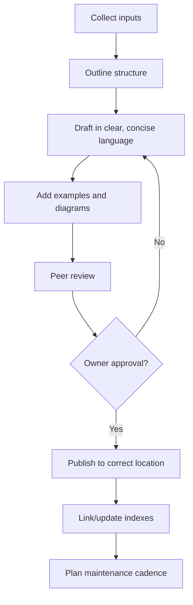

<!--
Purpose: Repository-wide instructions for authoring documentation. Sets expectations, rules, and workflows that AI assistants and humans must follow.
Prompting techniques: Uses clear headings, imperative rules, templates, and enforcement blocks to drive consistent outputs.
-->
# Documentation Instructions

This document provides mandatory guidelines for creating and maintaining project documentation across the repository. It applies to all Markdown files and specializes rules for ADRs, PRDs, and Design docs.

<!--
Purpose: Define the objectives and boundaries of these instructions.
Prompting techniques: Scope framing to align behavior and outcomes before execution.
-->
## Scope and Purpose

- Ensure all docs are clear, consistent, and easy to maintain.
- Provide a standard workflow for planning, drafting, reviewing, and publishing documentation.
- Define default structures, formatting rules, and approval gates.

<!--
Purpose: Establish universal style and clarity rules to apply across all docs.
Prompting techniques: Prescriptive bullet points with imperative tone for easy compliance.
-->
## General Guidelines

1. **Structure**: Organize documentation into clear sections with headings and subheadings.
2. **Clarity**: Use simple, concise language. Avoid unexplained jargon.
3. **Consistency**: Maintain a consistent style and format throughout the documentation.
4. **Examples**: Include examples and use cases to illustrate concepts.

<!--
Purpose: Ensure the assistant gathers critical inputs before drafting.
Prompting techniques: Input collection checklist with mandatory enforcement gate.
-->
## Inputs to Collect (before drafting)

- Purpose and scope of the document
- Target audience (developers, end-users, stakeholders)
- Key features, behaviors, or decisions to cover
- Existing related documentation or references

<PROCESS_REQUIREMENTS type="MANDATORY">
- If any inputs are missing or ambiguous, ask targeted questions and pause drafting until clarified.
- Confirm inferred inputs with the requester before proceeding.
</PROCESS_REQUIREMENTS>

<!--
Purpose: Define the review and approval lifecycle to ensure quality and accountability.
Prompting techniques: Stage-gated workflow steps; mandatory approval via enforcement block.
-->
## Document Review & Approval Process

1. **Initial Draft**: Create the first version following the general guidelines.
2. **Peer Review**: Request reviews from relevant stakeholders and address feedback.
3. **Approval**: Obtain final approval from the document owner before publishing.
4. **Publishing**: Place approved docs in the appropriate folder (e.g., `docs/`, `docs/ADRs/`, `plans/`).
5. **Archiving**: Establish a process for archiving outdated documents while ensuring they remain accessible for reference.

<CRITICAL_REQUIREMENT type="MANDATORY">
- Do not publish without owner approval.
- Save documents in their canonical locations with appropriate filenames.
- Update indices or README links when adding new documents.
</CRITICAL_REQUIREMENT>

<!--
Purpose: Provide a reusable scaffold for docs when the author does not specify a structure.
Prompting techniques: Template-driven prompting to ensure completeness and logical flow.
-->
## Documentation Structure Template

- Title
- Introduction
- Purpose and Scope
- Target Audience
- Key Features / Main Content
- Examples and Code Snippets
- Diagrams (if applicable)
- Maintenance and Update Instructions (if applicable)
- Conclusion
- References (if applicable)

<!--
Purpose: Standardize formatting to maximize readability and toolability.
Prompting techniques: Prescriptive style guide with concrete conventions (headings, lists, fenced code, links, images).
-->
## Formatting Guidelines

- Use Markdown with clear headings and subheadings.
- Prefer bullet points and numbered lists for clarity.
- Use fenced code blocks for code examples; include language identifiers.
- Link to related internal docs and authoritative external resources.
- Embed images/diagrams using Markdown.
- Ensure proper grammar and spelling.
- Avoid emojis and informal language.

<!--
Purpose: Provide specialized content requirements for common document types.
Prompting techniques: Pattern-based checklists per doc type for consistent outputs.
-->
## Document Types and Guidance

<!--
Purpose: ADR-specific required sections and storage conventions.
Prompting techniques: Checklist of mandatory sections and canonical location/naming.
-->
### Architectural Decision Records (ADRs)
1. **Purpose**: State the decision and the problem it addresses.
2. **Context**: Provide background and constraints.
3. **Options Considered**: List alternatives and why they were rejected or accepted.
4. **Decision**: Clearly state the chosen approach and rationale.
5. **Consequences**: Note implications, migration steps, and follow-ups.
 6. **Location & Naming**: Save under `docs/ADRs/` using the repository ADR naming convention and template (`docs/ADRs/adr-template.md`).

<!--
Purpose: PRD-specific structure to align product documentation with measurable outcomes.
Prompting techniques: Outcome-focused sections and canonical storage.
-->
### Product Requirements Documents (PRDs)
1. **Overview**: Summarize the product, purpose, and target audience.
2. **Goals & Objectives**: Define measurable goals.
3. **Stakeholders**: List stakeholders and roles.
4. **Success Criteria**: Define how success will be measured.
 5. **Location & Naming**: Save under `docs/PRDs/` using the repository PRD template (`docs/PRDs/prd-template.md`).

<!--
Purpose: Design doc structure to capture system architecture and concerns.
Prompting techniques: Sectioned guidance for architecture, data, APIs, UI, and security; canonical storage.
-->
### Design Documents
1. **Architecture**: Provide diagrams and component descriptions.
2. **Data Models**: Describe schemas and relationships.
3. **APIs**: Document endpoints, contracts, and authentication.
4. **User Interface**: Include wireframes, mockups, and accessibility notes.
5. **Security**: Outline security considerations and mitigations.
 6. **Location & Naming**: Save under `docs/design/` with a concise, descriptive filename.

<!--
Purpose: Define default file formats and locations to reduce ambiguity.
Prompting techniques: Defaults and canonical paths that tools and assistants can rely on.
-->
## Saving and Location

- Default format: Markdown (`.md`).
- Default directory: `/docs/` with a relevant filename when no specialized folder applies.
- Use specialized directories and templates for ADRs (`docs/ADRs/`), PRDs (`docs/PRDs/`), and Design docs (`docs/design/`).

<!--
Purpose: Establish acceptance criteria any doc must meet before publication.
Prompting techniques: Concise quality checklist that is easy to verify automatically.
-->
## Quality Gates

- All new or updated docs must pass a self-review for accuracy, completeness, and clarity.
- Ensure links are valid and images/diagrams render correctly in GitHub.
- Update indexes or README tables of contents where applicable.

<!--
Purpose: Visualize the documentation workflow and decision points.
Prompting techniques: Mermaid diagram with loopbacks and explicit approval gate to reinforce process.
-->

## Documentation Process (Flow)

