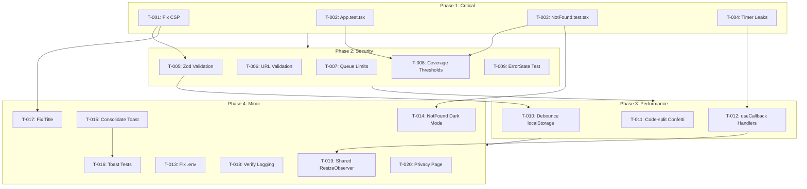

# Code Review Remediation Plan

## 1. Title

Remediate Critical, Major, and Minor Findings from January 2026 Code Review

## 2. Short description

Address 20 findings from the comprehensive code review, fixing critical security vulnerabilities (CSP, input validation), adding missing test coverage to meet the 90% policy requirement, and resolving performance issues (memory leaks, bundle size). This plan restores the security checklist app's credibility by practicing what it preaches.

## 3. Current status

```yaml
owner: TBD <owner@example.com>
state: proposed
last_updated: 2026-01-15
blockers: []
```

## 4. Objectives

1. Achieve 90% global test coverage and 95% coverage for core domain logic per the project's quality policy
2. Eliminate all critical security vulnerabilities (CSP weaknesses, input validation gaps, XSS vectors)
3. Fix all memory leaks and performance bottlenecks in the React component tree
4. Resolve all major findings before production deployment
5. Address minor findings to improve code quality and user experience
6. Enforce quality standards via CI/CD coverage thresholds

## 5. Success criteria

| Name | Metric | Target | Verification |
|------|--------|--------|--------------|
| Test Coverage | Global line coverage | ≥ 90% | `npm run test:coverage` output |
| Core Logic Coverage | Coverage for `src/services/`, `src/lib/` | ≥ 95% | Vitest coverage report |
| Critical Findings | Count of unresolved critical issues | 0 | Manual review against recommendations.md |
| Major Findings | Count of unresolved major issues | 0 | Manual review against recommendations.md |
| Memory Leaks | Timer cleanup in SectionCard | 100% cleanup on unmount | Unit tests with unmount assertions |
| Input Validation | JSON schema validation | All checklist data validated | Unit tests with malformed data |
| Bundle Size | react-confetti chunk | Lazy-loaded, not in main bundle | Build analysis with `vite-bundle-analyzer` |
| CSP Security | unsafe-inline removed | No unsafe-inline in CSP | Manual inspection of index.html |

## 6. Scope

```yaml
in:
  - Fix all 3 critical findings from recommendations.md
  - Fix all 9 major findings from recommendations.md
  - Fix all 8 minor findings from recommendations.md
  - Add missing test files (App.test.tsx, NotFound.test.tsx)
  - Install and configure Zod for runtime validation
  - Implement debounced localStorage writes
  - Add coverage thresholds to CI configuration
  - Create privacy policy page for cookie consent link
out:
  - Server-side rendering (SSR) implementation
  - Migration away from Google Tag Manager
  - Complete redesign of analytics architecture
  - Adding new features beyond remediation
  - Performance optimization beyond identified issues
```

## 7. Stakeholders & Roles

| Name | Role | Responsibility | Contact |
|------|------|----------------|---------|
| TBD | Engineering Lead | Delivery and code review | owner@example.com |
| TBD | Security Reviewer | Sign-off on security fixes | security@example.com |
| TBD | QA Lead | Verify test coverage targets | qa@example.com |

## 8. High-level timeline & milestones

1. `M1` — Critical fixes complete — 2026-01-17 — Engineering Lead
2. `M2` — Security hardening complete — 2026-01-22 — Engineering Lead
3. `M3` — Performance optimizations complete — 2026-01-24 — Engineering Lead
4. `M4` — Minor fixes and polish complete — 2026-01-27 — Engineering Lead
5. `M5` — Security review sign-off — 2026-01-28 — Security Reviewer
6. `M6` — QA verification complete — 2026-01-29 — QA Lead
7. `M7` — Production deployment — 2026-01-31 — Engineering Lead

## 9. Task list

### Phase 1: Critical Fixes (M1)

- T-001 | Fix CSP policy - remove unsafe-inline, externalize GTM consent script | Engineering Lead | complexity: M | deps: [] | done: false
- T-002 | Create App.test.tsx with routing, provider, and analytics init tests | Engineering Lead | complexity: M | deps: [] | done: false
- T-003 | Create NotFound.test.tsx with 404 logging and navigation tests | Engineering Lead | complexity: S | deps: [] | done: false
- T-004 | Fix timer memory leaks in SectionCard using refs for cleanup | Engineering Lead | complexity: S | deps: [] | done: false

### Phase 2: Security Hardening (M2)

- T-005 | Install Zod and implement JSON schema validation in checklistService | Engineering Lead | complexity: M | deps: [T-001] | done: false
- T-006 | Add URL scheme validation for external links (http/https only) | Engineering Lead | complexity: S | deps: [] | done: false
- T-007 | Implement analytics event queue size limit with FIFO eviction | Engineering Lead | complexity: S | deps: [] | done: false
- T-008 | Add coverage thresholds to vitest.config.ts (90% global, 95% core) | Engineering Lead | complexity: XS | deps: [T-002, T-003] | done: false
- T-009 | Add test for ErrorState retry button functionality | Engineering Lead | complexity: XS | deps: [] | done: false

### Phase 3: Performance Optimizations (M3)

- T-010 | Implement debounced localStorage writes using lodash.debounce | Engineering Lead | complexity: S | deps: [T-005] | done: false
- T-011 | Code-split react-confetti with React.lazy and Suspense | Engineering Lead | complexity: S | deps: [] | done: false
- T-012 | Add useCallback to SectionCard event handlers | Engineering Lead | complexity: S | deps: [T-004] | done: false

### Phase 4: Minor Fixes (M4)

- T-013 | Fix .env file - remove malformed content or delete file | Engineering Lead | complexity: XS | deps: [] | done: false
- T-014 | Add dark mode support to NotFound page | Engineering Lead | complexity: XS | deps: [T-003] | done: false
- T-015 | Remove duplicate toast hook - consolidate to single location | Engineering Lead | complexity: XS | deps: [] | done: false
- T-016 | Create use-toast.test.ts for the toast hook | Engineering Lead | complexity: S | deps: [T-015] | done: false
- T-017 | Fix index.html title to user-friendly "Security & Quality Checklist" | Engineering Lead | complexity: XS | deps: [T-001] | done: false
- T-018 | Verify console logging is removed in production builds | Engineering Lead | complexity: XS | deps: [] | done: false
- T-019 | Create shared ResizeObserver hook to reduce observer instances | Engineering Lead | complexity: M | deps: [T-012] | done: false
- T-020 | Create privacy policy page and update cookie consent link | Engineering Lead | complexity: M | deps: [] | done: false

### Phase 5: Verification (M5-M6)

- T-021 | Run full test suite and verify 90% coverage threshold met | QA Lead | complexity: S | deps: [T-001 through T-020] | done: false
- T-022 | Security review of all security-related changes | Security Reviewer | complexity: M | deps: [T-001, T-005, T-006, T-007] | done: false
- T-023 | Performance testing - verify no memory leaks, bundle size acceptable | QA Lead | complexity: S | deps: [T-004, T-010, T-011, T-012] | done: false

## 10. Risks and mitigations

| ID | Description | Probability | Impact | Mitigation | Owner |
|----|-------------|-------------|--------|------------|-------|
| R-001 | CSP changes break GTM/analytics functionality | Medium | High | Test in staging environment first; implement feature flags for rollback | Engineering Lead |
| R-002 | Zod validation too strict, rejects valid data | Low | Medium | Test against production checklist-data.json; add comprehensive error messages | Engineering Lead |
| R-003 | Coverage thresholds block legitimate PRs | Medium | Medium | Start with warning mode; gradually increase to error mode | Engineering Lead |
| R-004 | Debounced localStorage causes data loss on page close | Medium | Medium | Add beforeunload handler to flush pending writes | Engineering Lead |
| R-005 | Code-splitting confetti breaks animation timing | Low | Low | Test animation on section completion; fallback to inline if issues | Engineering Lead |

## 11. Assumptions

- The project uses Vite's built-in tree-shaking to remove development-only code in production builds
- GTM Consent Mode v2 will continue to function with externalized consent scripts
- The current checklist-data.json file is the canonical schema that Zod validation should match
- Test infrastructure (Vitest, React Testing Library) is properly configured and working
- No server-side changes are required; this is a client-only React application
- Team has access to merge to main branch after review approval
- Lodash (or lodash.debounce) can be added as a dependency for debouncing

## 12. Implementation approach / Technical narrative

**TL;DR:** This remediation follows a phased approach: critical security and test coverage first, then security hardening, performance, and polish. Each phase builds on the previous, with clear verification gates before production deployment.

### Phase 1: Critical Fixes

#### CSP Policy Remediation (T-001)

The current CSP allows `'unsafe-inline'` which defeats XSS protection. The fix involves:

1. **Externalize the GTM consent script** - Move the inline consent initialization to a separate `.js` file
2. **Remove unsafe-inline from script-src** - Update CSP to only allow specific sources
3. **Keep unsafe-inline for styles** (for now) - Tailwind CSS requires inline styles; removing requires significant refactoring

```html
<!-- Before -->
<meta http-equiv="Content-Security-Policy" 
  content="script-src 'self' 'unsafe-inline' https://...">

<!-- After -->
<meta http-equiv="Content-Security-Policy" 
  content="script-src 'self' https://... 'sha256-{hash-of-gtm-script}'">
```

Alternatively, use a nonce-based approach if hash maintenance becomes burdensome.

#### Timer Memory Leak Fix (T-004)

The SectionCard component has multiple `setTimeout` calls without proper cleanup:

```typescript
// Current problematic pattern
useEffect(() => {
  if (newProgress === 100) {
    setShowConfetti(true);
    const timer = setTimeout(() => setShowConfetti(false), 5000);
    return () => clearTimeout(timer); // Only cleans up if this branch executes
  }
  // Other branches don't return cleanup functions
}, [dependencies]);

// Fixed pattern with refs
const confettiTimerRef = useRef<NodeJS.Timeout | null>(null);
const animationTimerRef = useRef<NodeJS.Timeout | null>(null);

useEffect(() => {
  // Clear any existing timers first
  if (confettiTimerRef.current) clearTimeout(confettiTimerRef.current);
  if (animationTimerRef.current) clearTimeout(animationTimerRef.current);

  if (newProgress === 100) {
    setShowConfetti(true);
    confettiTimerRef.current = setTimeout(() => setShowConfetti(false), 5000);
  }
  
  animationTimerRef.current = setTimeout(() => setIsAnimating(false), 1000);

  // Cleanup function always runs on unmount
  return () => {
    if (confettiTimerRef.current) clearTimeout(confettiTimerRef.current);
    if (animationTimerRef.current) clearTimeout(animationTimerRef.current);
  };
}, [dependencies]);
```

### Phase 2: Security Hardening

#### Zod Validation (T-005)

Install Zod and create runtime validation for checklist data:

```typescript
// src/services/checklistService.ts
import { z } from 'zod';

const ChecklistItemSchema = z.object({
  id: z.string().min(1),
  title: z.string().min(1),
  description: z.string(),
  summary: z.string().optional(),
  link: z.string().url().optional(),
  externalLink: z.string().url().optional(),
});

const ChecklistSectionSchema = z.object({
  id: z.string().min(1),
  title: z.string().min(1),
  description: z.string(),
  items: z.array(ChecklistItemSchema).min(1),
});

const ChecklistSchema = z.object({
  title: z.string().min(1),
  sections: z.array(ChecklistSectionSchema).min(1),
});

export async function fetchChecklist(): Promise<Checklist> {
  const response = await fetch('/checklist-data.json');
  if (!response.ok) {
    throw new Error('Failed to load checklist data');
  }
  
  const data = await response.json();
  
  // Validate and parse - throws ZodError if invalid
  return ChecklistSchema.parse(data);
}
```

#### URL Validation (T-006)

Add validation before opening external links:

```typescript
// src/lib/urlValidation.ts
export function isValidExternalUrl(url: string): boolean {
  try {
    const parsed = new URL(url);
    return ['http:', 'https:'].includes(parsed.protocol);
  } catch {
    return false;
  }
}

// Usage in SectionCard.tsx
{selectedItem?.link && isValidExternalUrl(selectedItem.link) && (
  <a href={selectedItem.link} ...>
```

### Phase 3: Performance

#### Debounced localStorage (T-010)

```typescript
// src/services/checklistService.ts
import debounce from 'lodash.debounce';

const debouncedWrite = debounce((state: Record<string, boolean>) => {
  localStorage.setItem(STORAGE_KEY, JSON.stringify(state));
}, 500);

export function saveChecklistState(checkedItems: Record<string, boolean>): void {
  debouncedWrite(checkedItems);
}

// Add flush on page unload
if (typeof window !== 'undefined') {
  window.addEventListener('beforeunload', () => {
    debouncedWrite.flush();
  });
}
```

#### Code-split Confetti (T-011)

```typescript
// src/components/SectionCard.tsx
import { lazy, Suspense } from 'react';

const ReactConfetti = lazy(() => import('react-confetti'));

// In render:
{showConfetti && dimensions.width > 0 && (
  <Suspense fallback={null}>
    <ReactConfetti ... />
  </Suspense>
)}
```

### Architecture Diagram



## 13. Testing & validation plan

### Unit Tests

- **Scope:** All new code and modified files
- **Coverage Target:** 90% global, 95% for `src/services/` and `src/lib/`
- **Key Test Files to Create:**
  - `src/App.test.tsx` - Routing, provider setup, analytics initialization
  - `src/pages/NotFound.test.tsx` - 404 logging, navigation, dark mode
  - `src/hooks/use-toast.test.ts` - Toast state management
  - Additional tests for modified components

### Integration Tests

- Verify Zod validation rejects malformed JSON and accepts valid JSON
- Verify URL validation blocks javascript: and data: URLs
- Verify analytics queue limits work correctly with consent flow
- Verify debounced localStorage writes persist on page unload

### End-to-End Scenarios

- Complete checklist flow: load → check items → verify persistence
- Error recovery: fail load → show error → click retry → verify recovery
- Consent flow: arrive → interact → grant consent → verify queued events sent

### Performance Testing

- Bundle size analysis with `vite-bundle-analyzer`
- Memory profiling to verify no timer leaks
- Interaction timing to verify no jank from localStorage writes

## 14. Deployment plan & roll-back strategy

### Environments

1. **Local Development** - Developer machines
2. **Preview/Staging** - Vercel preview deployments on PR
3. **Production** - Vercel production deployment

### Deployment Steps

1. Create PR from `plan/code-review-remediation` branch
2. Automated tests run on PR (must pass with 90% coverage)
3. Security review approval required
4. Deploy to Vercel preview environment
5. Manual QA verification on preview
6. Merge to main (triggers production deployment)
7. Post-deployment smoke test

### Roll-back Criteria

- Test coverage drops below 90%
- Any critical security vulnerability reintroduced
- GTM/analytics functionality broken
- User-reported errors increase by >10%

### Roll-back Steps

1. Revert merge commit on main: `git revert <commit-sha>`
2. Push revert to main (triggers deployment)
3. Verify production restored
4. Create incident report and remediation plan

## 15. Monitoring & observability

| Metric | Unit | Target | Alert Threshold |
|--------|------|--------|-----------------|
| Test Coverage | Percentage | ≥ 90% | < 85% |
| Bundle Size (main) | KB | < 300 | > 350 |
| Build Time | Seconds | < 60 | > 120 |
| Lighthouse Performance | Score | > 90 | < 80 |

### Alerts

- Coverage threshold failure in CI → Block PR merge
- Bundle size increase > 20% → Warning in PR comments
- Build failure → Slack notification to team

### Dashboards

- Vercel Analytics dashboard for production performance
- GitHub Actions dashboard for CI/CD status
- Coverage trends via Codecov or similar (if configured)

## 16. Compliance, security & privacy considerations

### Data Classification

- **Checklist progress data:** Low sensitivity, stored in localStorage
- **Analytics events:** Medium sensitivity, subject to consent
- **No PII collected** by the application itself

### Compliance Controls

- **GDPR:** Cookie consent banner with proper GTM Consent Mode v2 integration
- **Privacy Policy:** Must exist and be linked from consent banner (T-020)

### Security Review Checklist

- [ ] CSP policy reviewed and unsafe-inline removed
- [ ] All external links validated for safe protocols
- [ ] JSON input validated with Zod schemas
- [ ] No sensitive data in localStorage
- [ ] Analytics queue has size limits
- [ ] Console logging disabled in production
- [ ] Dependencies scanned for vulnerabilities

## 17. Communication plan

| Event | Audience | Channel | Timing |
|-------|----------|---------|--------|
| Plan Approved | Engineering Team | Slack #engineering | Immediately after approval |
| Phase 1 Complete | Stakeholders | Email | After M1 milestone |
| Ready for Security Review | Security Team | Slack #security | Before M5 |
| Production Deployment | All Stakeholders | Email + Slack | After M7 |
| Rollback (if needed) | All Stakeholders | Slack #incidents | Immediately |

## 18. Related documents & links

- [Code Review Recommendations](/recommendations.md)
- [Quality & Coverage Policy](/.github/copilot-instructions.md#quality-policy)
- [Vitest Coverage Documentation](https://vitest.dev/guide/coverage.html)
- [Zod Documentation](https://zod.dev/)
- [CSP Reference](https://developer.mozilla.org/en-US/docs/Web/HTTP/CSP)

## 19. Appendix

### A. Finding-to-Task Mapping

| Finding # | Severity | Task ID(s) |
|-----------|----------|------------|
| 1 | Critical | T-001 |
| 2 | Critical | T-002, T-003 |
| 3 | Critical | T-004 |
| 4 | Major | T-005 |
| 5 | Major | T-006 |
| 6 | Major | T-010 |
| 7 | Major | T-009 |
| 8 | Major | T-011 |
| 9 | Major | T-001 (partial - SRI consideration) |
| 10 | Major | T-007 |
| 11 | Major | T-012 |
| 12 | Major | T-008 |
| 13 | Minor | T-013 |
| 14 | Minor | T-014 |
| 15 | Minor | T-015 |
| 16 | Minor | T-016 |
| 17 | Minor | T-017 |
| 18 | Minor | T-018 |
| 19 | Minor | T-019 |
| 20 | Minor | T-020 |

### B. New Dependencies to Install

```bash
# Runtime dependencies
npm install zod lodash.debounce

# Type definitions
npm install -D @types/lodash.debounce
```

### C. Files to Create

| File | Purpose |
|------|---------|
| `src/App.test.tsx` | Root component tests |
| `src/pages/NotFound.test.tsx` | 404 page tests |
| `src/hooks/use-toast.test.ts` | Toast hook tests |
| `src/pages/Privacy.tsx` | Privacy policy page |
| `src/lib/urlValidation.ts` | URL validation utilities |
| `src/hooks/useSharedResizeObserver.ts` | Shared observer hook |
| `public/js/gtm-consent.js` | Externalized GTM consent script |

### D. Files to Modify

| File | Changes |
|------|---------|
| `index.html` | CSP policy, externalize script, fix title |
| `src/components/SectionCard.tsx` | Timer refs, useCallback, code-split confetti, URL validation |
| `src/services/checklistService.ts` | Zod validation, debounced writes |
| `src/lib/analytics.ts` | Queue size limits |
| `src/pages/NotFound.tsx` | Dark mode support |
| `src/components/ErrorState.tsx` | Add button type |
| `src/components/CookieConsentBanner.tsx` | Update privacy link |
| `vitest.config.ts` | Coverage thresholds |
| `package.json` | New dependencies |
| `.env` | Fix or remove malformed content |

---

**Checklist before marking plan as ready for review:**

- [x] All minimal required fields are filled
- [x] Dates validated (ISO 8601)
- [x] Complexity assigned to each task (XS/S/M/L/XL)
- [x] At least one test/validation approach is defined
- [x] Security & compliance items are noted
