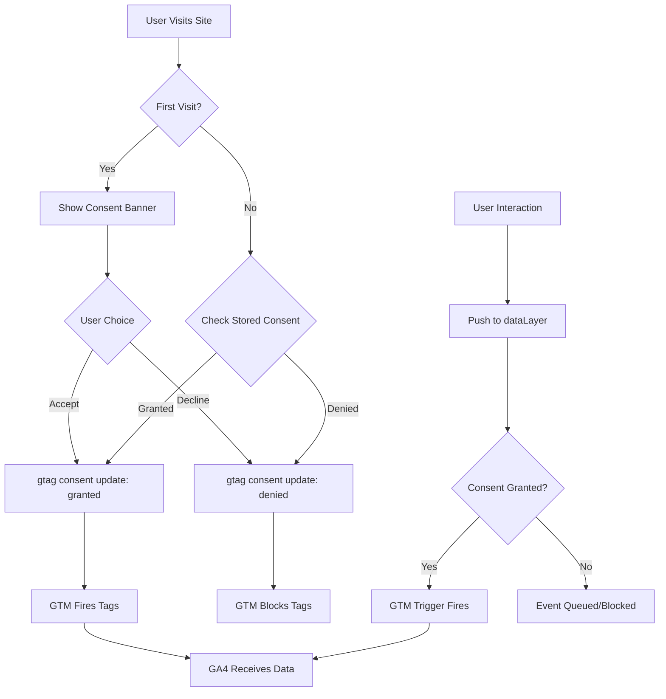
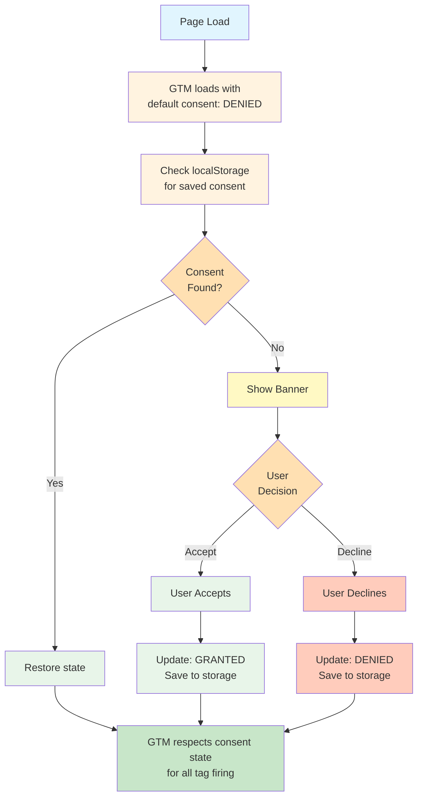

# GA4 Analytics Implementation Plan

## 1. Title

Implement Google Analytics 4 (GA4) with GTM and Cookie Consent for the Security Checklist application

## 2. Short description

Add GA4 analytics via Google Tag Manager (GTM) with GDPR-compliant cookie consent, tracking user engagement with the security checklist including page views, checklist interactions, and progress milestones.

## 3. Current status

```yaml
owner: Sam Carrington
state: approved
last_updated: 2026-01-09
blockers: []
```

## 4. Objectives

1. Implement GTM container `GTM-NJ7W8HQ8` to manage GA4 tag with measurement ID `G-517LEH65ZW`
2. Add GDPR/CCPA-compliant cookie consent banner with GTM Consent Mode v2 integration
3. Track page views and user sessions (respecting consent state)
4. Capture checklist interaction events via GTM data layer
5. Monitor user progress milestones (25%, 50%, 75%, 100% completion)
6. Enable data-driven insights while maintaining privacy compliance

## 5. Success criteria

| Name                | Metric                                 | Target                     | Verification                        |
| ------------------- | -------------------------------------- | -------------------------- | ----------------------------------- |
| GTM Loading         | GTM container loads without CSP errors | 0 CSP violations           | Browser console check in production |
| Consent Banner      | Banner displays on first visit         | 100% of new sessions       | Manual testing across browsers      |
| Consent Persistence | Consent choice persisted correctly     | Survives page refresh      | localStorage/cookie inspection      |
| Consent Respected   | No tracking before consent granted     | 0 events before consent    | GTM Preview + Network tab           |
| Page View Tracking  | Page views recorded after consent      | 100% of consented sessions | GA4 Realtime report                 |
| Event Tracking      | Custom events fire correctly           | All events in DebugView    | GTM Preview mode validation         |
| Performance Impact  | Page load degradation                  | < 150ms increase           | Lighthouse performance audit        |
| Bundle Size         | Additional JS payload                  | < 80KB total               | Build output + network analysis     |

## 6. Scope

```yaml
in:
  - GTM container setup and installation in index.html
  - GA4 tag configuration within GTM (using measurement ID G-517LEH65ZW)
  - GTM Consent Mode v2 implementation with default denied state
  - Cookie consent banner component (react-cookie-consent library)
  - Consent state synchronization with GTM
  - CSP policy updates for GTM and GA4 domains
  - Data layer utility module for pushing events
  - Page view tracking via GTM History Change trigger
  - Custom event tracking for checkbox interactions (data layer push)
  - Section completion and progress milestone events
  - Theme toggle and clear all button events
  - Debug mode for development environment

out:
  - User identification or authentication tracking (no user accounts exist)
  - Enhanced e-commerce tracking (not applicable)
  - Server-side GTM or analytics
  - A/B testing framework setup
  - Custom GA4 dashboard creation (use default reports)
  - Privacy policy page creation (document requirements only)
  - GA4 Enhanced Measurement for form tracking (not compatible with Radix UI)
```

## 7. Stakeholders & Roles

| Name | Role          | Responsibility          | Contact        |
| ---- | ------------- | ----------------------- | -------------- |
| TBD  | Project Owner | Approval and acceptance | Sam Carrington |
| TBD  | Developer     | Implementation          | OpenCode.      |

## 8. High-level timeline & milestones

1. `M1` - Plan approved - TBD - Project Owner
2. `M2` - GTM container created and CSP updated - TBD - Developer
3. `M3` - Cookie consent banner implemented - TBD - Developer
4. `M4` - GTM Consent Mode integrated - TBD - Developer
5. `M5` - Basic tracking live (page views) - TBD - Developer
6. `M6` - Custom event tracking complete - TBD - Developer
7. `M7` - Testing & validation complete - TBD - Developer
8. `M8` - Production deployment - TBD - Developer

## 9. Task list

| ID    | Task                                                           | Owner          | Complexity | Dependencies                               | Done  |
| ----- | -------------------------------------------------------------- | -------------- | ---------- | ------------------------------------------ | ----- |
| T-001 | Create GTM container and configure GA4 tag                     | Sam Carrington | M          | []                                         | true  |
| T-002 | Update CSP policy in index.html for GTM and GA4 domains        | TBD            | S          | []                                         | false |
| T-003 | Add GTM container snippet to index.html with consent defaults  | TBD            | S          | [T-001, T-002]                             | false |
| T-004 | Install react-cookie-consent package                           | TBD            | XS         | []                                         | false |
| T-005 | Create CookieConsent component with accept/decline actions     | TBD            | M          | [T-004]                                    | false |
| T-006 | Implement consent state persistence (localStorage)             | TBD            | S          | [T-005]                                    | false |
| T-007 | Add gtag consent update calls on user choice                   | TBD            | M          | [T-003, T-006]                             | false |
| T-008 | Configure GTM Consent Mode v2 with regional defaults           | TBD            | M          | [T-001, T-007]                             | false |
| T-009 | Create data layer utility module (src/lib/analytics.ts)        | TBD            | M          | [T-003]                                    | false |
| T-010 | Configure GTM History Change trigger for SPA page views        | TBD            | S          | [T-001]                                    | false |
| T-011 | Add checkbox toggle event tracking in SectionCard              | TBD            | M          | [T-009]                                    | false |
| T-012 | Add section completion event tracking                          | TBD            | S          | [T-011]                                    | false |
| T-013 | Add progress milestone event tracking (25%, 50%, 75%, 100%)    | TBD            | M          | [T-009]                                    | false |
| T-014 | Add theme toggle event tracking                                | TBD            | XS         | [T-009]                                    | false |
| T-015 | Add clear all button event tracking                            | TBD            | XS         | [T-009]                                    | false |
| T-016 | Create GTM triggers and tags for custom events                 | TBD            | M          | [T-001, T-011, T-012, T-013, T-014, T-015] | false |
| T-017 | Add debug mode logging for development environment             | TBD            | S          | [T-009]                                    | false |
| T-018 | Test consent flow in GTM Preview mode                          | TBD            | M          | [T-008, T-010, T-016]                      | false |
| T-019 | Validate all events in GA4 DebugView                           | TBD            | M          | [T-018]                                    | false |
| T-020 | Test consent banner across browsers (Chrome, Firefox, Safari)  | TBD            | S          | [T-005]                                    | false |
| T-021 | Document analytics events, consent flow, and GTM configuration | TBD            | S          | [T-019]                                    | false |

## 10. Risks and mitigations

| ID    | Description                                                 | Probability | Impact | Mitigation                                                                                          | Owner |
| ----- | ----------------------------------------------------------- | ----------- | ------ | --------------------------------------------------------------------------------------------------- | ----- |
| R-001 | CSP policy blocks GTM/GA4 scripts                           | Low         | High   | Test CSP changes thoroughly in staging; use exact Google-recommended domains                        | TBD   |
| R-002 | Performance degradation from GTM + consent library          | Medium      | Medium | Use async loading; defer non-critical scripts; monitor Lighthouse scores; target < 150ms impact     | TBD   |
| R-003 | GDPR non-compliance due to tracking before consent          | Medium      | High   | Default consent to denied; comprehensive testing of consent flow; audit with GTM Preview            | TBD   |
| R-004 | Consent state not persisted correctly                       | Low         | Medium | Test localStorage persistence; handle cookie clearing scenarios; provide re-consent mechanism       | TBD   |
| R-005 | GTM container misconfiguration causing missing events       | Medium      | Medium | Use GTM Preview mode extensively; document all triggers and tags; version control GTM config        | TBD   |
| R-006 | Radix UI checkboxes not tracked by GA4 Enhanced Measurement | Confirmed   | Medium | Use custom data layer events; already planned - not relying on built-in form tracking               | TBD   |
| R-007 | Users declining consent results in no analytics data        | Medium      | Low    | Accept as expected behavior; focus on improving consent UX; consider analytics for consented subset | TBD   |

## 11. Assumptions

- A GTM container ID is created (tag id `GTM-NJ7W8HQ8`)
- The GA4 property `G-517LEH65ZW` is already created and configured in Google Analytics
- GDPR compliance requires explicit opt-in consent for EU users (default denied)
- GA4's Enhanced Measurement form tracking will NOT work with Radix UI checkboxes (custom tracking required)
- Cookie consent preferences will be stored in localStorage (not cookies, to avoid irony)
- No server-side tracking or GTM server container is required
- The existing Vite build pipeline supports the planned implementation without changes

## 12. Implementation approach / Technical narrative

**TL;DR**: Use GTM to manage GA4 with Consent Mode v2, implement a cookie consent banner using react-cookie-consent, push custom events to the data layer since GA4 cannot automatically track Radix UI checkbox interactions.

### Architecture Decision: GTM vs Direct gtag.js

We are using **Google Tag Manager (GTM)** instead of direct gtag.js for the following reasons:

1. **Consent Mode Integration**: GTM provides built-in Consent Mode v2 support for GDPR/CCPA compliance
2. **Tag Management**: Easier to modify tracking without code deployments
3. **Debugging**: GTM Preview mode provides superior debugging capabilities
4. **Future Flexibility**: Easy to add additional tags (marketing pixels, A/B testing) without code changes
5. **Industry Standard**: GTM is the recommended approach for production analytics implementations

### Why Custom Event Tracking is Required

**GA4 Enhanced Measurement does NOT track Radix UI checkboxes** because:

1. Enhanced Measurement only tracks native HTML `<form>` elements with `form_start` and `form_submit` events
2. Radix UI `<Checkbox>` components render as `<button role="checkbox">`, not `<input type="checkbox">`
3. The checkboxes in this app are not inside a `<form>` element
4. Individual checkbox state changes are not captured by any GA4 automatic tracking

**Therefore, we must use custom data layer events** for all checkbox interactions.

### Implementation Flow



### CSP Policy Updates

The Content Security Policy must be updated to allow GTM and GA4 domains:

```html
<!-- Current CSP -->
content="default-src 'self'; script-src 'self' https://cdn.gpteng.co; style-src
'self' 'unsafe-inline'; img-src 'self' data: https:; font-src 'self' data:;
connect-src 'self' https:;"

<!-- Updated CSP -->
content="default-src 'self'; script-src 'self' https://cdn.gpteng.co
https://www.googletagmanager.com https://www.google-analytics.com; style-src
'self' 'unsafe-inline'; img-src 'self' data: https:
https://www.googletagmanager.com; font-src 'self' data:; connect-src 'self'
https: https://www.google-analytics.com https://analytics.google.com
https://www.googletagmanager.com;"
```

### GTM Container Installation with Consent Defaults

Add the following to `index.html` in the `<head>` section:

```html
<!-- Google Tag Manager with Consent Mode v2 defaults -->
<script>
  // Initialize dataLayer
  window.dataLayer = window.dataLayer || [];
  function gtag() {
    dataLayer.push(arguments);
  }

  // Set default consent to denied (GDPR compliant)
  gtag("consent", "default", {
    ad_storage: "denied",
    ad_user_data: "denied",
    ad_personalization: "denied",
    analytics_storage: "denied",
    wait_for_update: 500, // Wait for consent banner
  });

  // Optional: Set granted for non-EU regions
  // gtag('consent', 'default', {
  //   'ad_storage': 'granted',
  //   'analytics_storage': 'granted',
  //   'region': ['US', 'CA'] // Non-EU countries
  // });
</script>

<!-- Google Tag Manager -->
<script>
  (function (w, d, s, l, i) {
    w[l] = w[l] || [];
    w[l].push({ "gtm.start": new Date().getTime(), event: "gtm.js" });
    var f = d.getElementsByTagName(s)[0],
      j = d.createElement(s),
      dl = l != "dataLayer" ? "&l=" + l : "";
    j.async = true;
    j.src = "https://www.googletagmanager.com/gtm.js?id=" + i + dl;
    f.parentNode.insertBefore(j, f);
  })(window, document, "script", "dataLayer", "GTM-XXXXXXX"); // Replace with actual GTM ID
</script>
```

Add to `<body>` immediately after opening tag:

```html
<!-- Google Tag Manager (noscript) -->
<noscript>
  <iframe
    src="https://www.googletagmanager.com/ns.html?id=GTM-NJ7W8HQ8"
    height="0"
    width="0"
    style="display:none;visibility:hidden"
  >
  </iframe>
</noscript>
```

### Cookie Consent Component

Install the library:

```bash
npm install react-cookie-consent
```

Create `src/components/CookieConsentBanner.tsx`:

```typescript
import CookieConsent from "react-cookie-consent";
import { updateConsent, ConsentState } from "@/lib/analytics";

export function CookieConsentBanner() {
  const handleAccept = () => {
    updateConsent(ConsentState.GRANTED);
  };

  const handleDecline = () => {
    updateConsent(ConsentState.DENIED);
  };

  return (
    <CookieConsent
      location="bottom"
      buttonText="Accept"
      declineButtonText="Decline"
      enableDeclineButton
      onAccept={handleAccept}
      onDecline={handleDecline}
      cookieName="analytics_consent"
      style={{
        background: "hsl(var(--background))",
        color: "hsl(var(--foreground))",
        borderTop: "1px solid hsl(var(--border))",
      }}
      buttonStyle={{
        background: "hsl(var(--primary))",
        color: "hsl(var(--primary-foreground))",
        borderRadius: "6px",
        padding: "8px 16px",
      }}
      declineButtonStyle={{
        background: "transparent",
        border: "1px solid hsl(var(--border))",
        color: "hsl(var(--foreground))",
        borderRadius: "6px",
        padding: "8px 16px",
      }}
    >
      We use cookies to analyze site usage and improve your experience.{" "}
      <a href="/privacy" className="underline">
        Learn more
      </a>
    </CookieConsent>
  );
}
```

### Data Layer Utility Module

Create `src/lib/analytics.ts`:

```typescript
// Type definitions
declare global {
  interface Window {
    dataLayer: Record<string, unknown>[];
    gtag: (...args: unknown[]) => void;
  }
}

export enum ConsentState {
  GRANTED = "granted",
  DENIED = "denied",
}

const CONSENT_KEY = "analytics_consent_state";

/**
 * Update GTM consent state
 */
export function updateConsent(state: ConsentState): void {
  if (typeof window.gtag !== "function") return;

  window.gtag("consent", "update", {
    ad_storage: state,
    ad_user_data: state,
    ad_personalization: state,
    analytics_storage: state,
  });

  // Persist consent choice
  localStorage.setItem(CONSENT_KEY, state);

  if (import.meta.env.DEV) {
    console.log("[Analytics] Consent updated:", state);
  }
}

/**
 * Check and restore saved consent state on page load
 */
export function restoreConsent(): void {
  const savedConsent = localStorage.getItem(CONSENT_KEY) as ConsentState | null;

  if (savedConsent) {
    updateConsent(savedConsent);
  }
}

/**
 * Push event to GTM data layer
 */
export function pushEvent(
  eventName: string,
  params?: Record<string, string | number | boolean>
): void {
  window.dataLayer = window.dataLayer || [];

  const eventData = {
    event: eventName,
    ...params,
  };

  window.dataLayer.push(eventData);

  if (import.meta.env.DEV) {
    console.log("[Analytics] Event pushed:", eventData);
  }
}

// Specific event helpers
export function trackCheckboxToggle(
  itemId: string,
  sectionId: string,
  sectionTitle: string,
  itemTitle: string,
  checked: boolean
): void {
  pushEvent("checkbox_toggle", {
    item_id: itemId,
    section_id: sectionId,
    section_title: sectionTitle,
    item_title: itemTitle,
    checked,
  });
}

export function trackSectionComplete(
  sectionId: string,
  sectionTitle: string,
  itemCount: number
): void {
  pushEvent("section_complete", {
    section_id: sectionId,
    section_title: sectionTitle,
    item_count: itemCount,
  });
}

export function trackProgressMilestone(percentage: number): void {
  pushEvent("progress_milestone", {
    percentage,
  });
}

export function trackThemeChange(theme: string): void {
  pushEvent("theme_change", {
    theme,
  });
}

export function trackClearAll(sectionId: string, sectionTitle: string): void {
  pushEvent("clear_all", {
    section_id: sectionId,
    section_title: sectionTitle,
  });
}
```

### GTM Configuration

Configure the following in GTM:

**Variables:**

- Built-in: Page Path, Page URL, Click Element
- Data Layer Variables: item_id, section_id, section_title, item_title, checked, percentage, theme

**Triggers:**

1. `History Change` - For SPA page view tracking
2. `Custom Event: checkbox_toggle` - Event equals "checkbox_toggle"
3. `Custom Event: section_complete` - Event equals "section_complete"
4. `Custom Event: progress_milestone` - Event equals "progress_milestone"
5. `Custom Event: theme_change` - Event equals "theme_change"
6. `Custom Event: clear_all` - Event equals "clear_all"

**Tags:**

1. `GA4 Configuration` - Google Analytics: GA4 Configuration tag
   - Measurement ID: G-517LEH65ZW
   - Consent Settings: Require consent for analytics_storage
2. `GA4 Event - Page View` - GA4 Event tag
   - Configuration Tag: GA4 Configuration
   - Event Name: page_view
   - Trigger: History Change
3. `GA4 Event - Checkbox Toggle` - GA4 Event tag

   - Event Name: checkbox_toggle
   - Event Parameters: item_id, section_id, section_title, item_title, checked
   - Trigger: Custom Event: checkbox_toggle

4. Similar tags for section_complete, progress_milestone, theme_change, clear_all

### Component Integration

**App.tsx** - Add consent banner and restore consent:

```typescript
import { CookieConsentBanner } from "@/components/CookieConsentBanner";
import { useEffect } from "react";
import { restoreConsent } from "@/lib/analytics";

const App = () => {
  useEffect(() => {
    restoreConsent();
  }, []);

  return (
    <ThemeProvider>
      {/* ... existing providers ... */}
      <CookieConsentBanner />
    </ThemeProvider>
  );
};
```

**SectionCard.tsx** - Add checkbox tracking:

```typescript
import { trackCheckboxToggle, trackSectionComplete, trackClearAll } from '@/lib/analytics';

// In onCheckedChange handler:
onCheckedChange={(checked) => {
  onItemToggle(item.id, checked === true);
  trackCheckboxToggle(item.id, section.id, section.title, item.title, checked === true);
}}

// When section reaches 100%:
if (newProgress === 100) {
  trackSectionComplete(section.id, section.title, section.items.length);
}

// In handleClearSection:
trackClearAll(section.id, section.title);
```

## 13. Testing & validation plan

### Unit Tests

- Test analytics utility functions with mocked dataLayer
- Verify consent state persistence in localStorage
- Test graceful handling when GTM is not loaded

### Integration Tests

- Verify consent banner appears on first visit
- Test accept/decline flows update GTM consent correctly
- Verify consent persists across page refreshes
- Test checkbox toggle events push to dataLayer
- Validate milestone events trigger at correct thresholds

### GTM Preview Mode Testing

- Validate all custom event triggers fire correctly
- Verify GA4 tags only fire when consent is granted
- Check event parameters contain expected values
- Test History Change trigger for SPA navigation

### End-to-End Testing

- Use GA4 DebugView to validate events reach GA4
- Test complete user journey: consent -> interactions -> completion
- Verify no events sent before consent granted (Network tab inspection)

### Cross-Browser Testing

- Test consent banner in Chrome, Firefox, Safari, Edge
- Verify localStorage persistence works correctly
- Check banner styling in light/dark modes

### Performance Testing

- Run Lighthouse audit before and after implementation
- Measure Total Blocking Time (TBT) impact from GTM
- Verify async loading doesn't block initial render

## 14. Deployment plan & roll-back strategy

### Environments

1. **Development** - Local testing with GTM Preview mode
2. **Staging/Preview** - Vercel preview deployments with GTM debug
3. **Production** - Live site with published GTM container

### Deployment Steps

1. Create GTM container and configure (no publish yet)
2. Deploy CSP changes to staging; verify no regressions
3. Deploy GTM snippet and consent banner to staging
4. Test consent flow thoroughly in staging
5. Configure and test all GTM triggers/tags in Preview mode
6. Publish GTM container to production
7. Deploy code changes to production
8. Validate in GA4 Realtime reports
9. Monitor for 48 hours for any issues

### Roll-back Criteria

- CSP violations blocking critical functionality
- Consent banner preventing app usage
- JavaScript errors affecting app functionality
- Significant performance degradation (>200ms increase)
- GDPR compliance issues (tracking without consent)

### Roll-back Steps

1. Unpublish GTM container (immediate effect)
2. Optionally: Remove GTM snippets from index.html
3. Revert CSP policy changes if needed
4. Analytics utility code can remain (no-ops without GTM)

## 15. Monitoring & observability

### Metrics to Collect

| Metric                         | Unit       | Target                  |
| ------------------------------ | ---------- | ----------------------- |
| Consent Rate                   | percentage | Track accept vs decline |
| Daily Active Users (consented) | count      | Baseline tracking       |
| Session Duration               | seconds    | > 60s average           |
| Checklist Completion Rate      | percentage | Track over time         |
| Events per Session             | count      | 3-10 typical            |

### Alerts

- No automated alerts (GA4 is pull-based)
- Monitor browser console for errors in development
- Check GTM container for configuration errors

### Dashboards

- GA4 Realtime overview for immediate validation
- GA4 Events report for interaction analysis
- GTM Container overview for tag firing rates
- Custom exploration reports for consent funnel

## 16. Compliance, security & privacy considerations

### Data Classification

- **User interaction data**: Low sensitivity (anonymous usage patterns)
- **No PII collected**: No user identification or authentication tracking
- **IP anonymization**: Enabled by default in GA4
- **Consent preferences**: Stored locally, not sent to servers

### GDPR Compliance

- Default consent state is **denied** for all EU users
- Explicit opt-in required before any tracking
- User can decline and still use the application
- Consent choice persisted in localStorage
- No tracking occurs until user grants consent

### CCPA Compliance

- Opt-out mechanism provided via decline button
- No sale of personal information (anonymous analytics only)

### Privacy Compliance Checklist

- [ ] Consent banner displayed before any tracking
- [ ] Accept and Decline options clearly visible
- [ ] No cookies set before consent
- [ ] Consent state persisted correctly
- [ ] GA4 receives no data before consent granted
- [ ] Privacy policy link in consent banner

### Security Considerations

- GTM container ID is designed to be public (client-side)
- No sensitive data transmitted to analytics
- CSP policy restricts script sources to trusted domains only
- All Google domains loaded over HTTPS

## 17. Communication plan

### Notifications

| Event               | Audience         | Channel     | Template                                                        |
| ------------------- | ---------------- | ----------- | --------------------------------------------------------------- |
| Plan Approved       | Development Team | Slack/Email | "GA4/GTM Analytics plan approved, implementation starting"      |
| GTM Container Ready | Development Team | Slack       | "GTM container created: GTM-XXXXXXX, ready for testing"         |
| Staging Deploy      | QA/Stakeholders  | Slack       | "Analytics with consent banner deployed to staging for testing" |
| Production Deploy   | Stakeholders     | Slack/Email | "GA4 Analytics live in production with cookie consent"          |
| Issues Detected     | Development Team | Slack       | "Analytics issue detected: [description], investigating"        |

## 18. Related documents & links

- [GA4 Implementation Research Findings](./ga4-research-findings.md)
- [Google Tag Manager Documentation](https://support.google.com/tagmanager)
- [GTM Consent Mode v2 Guide](https://support.google.com/tagmanager/answer/10718549)
- [Google Analytics 4 Documentation](https://developers.google.com/analytics/devguides/collection/ga4)
- [react-cookie-consent Documentation](https://github.com/Mastermindzh/react-cookie-consent)
- [GDPR Cookie Consent Requirements](https://gdpr.eu/cookies/)
- [Content Security Policy Reference](https://developer.mozilla.org/en-US/docs/Web/HTTP/CSP)

## 19. Appendix

### Event Catalog

| Event Name           | Description                | Parameters                                                        | GTM Trigger    |
| -------------------- | -------------------------- | ----------------------------------------------------------------- | -------------- |
| `page_view`          | SPA page navigation        | `page_path` (automatic)                                           | History Change |
| `checkbox_toggle`    | Checklist item toggled     | `item_id`, `section_id`, `section_title`, `item_title`, `checked` | Custom Event   |
| `section_complete`   | Section reached 100%       | `section_id`, `section_title`, `item_count`                       | Custom Event   |
| `progress_milestone` | Overall progress milestone | `percentage` (25, 50, 75, 100)                                    | Custom Event   |
| `theme_change`       | Theme toggle clicked       | `theme` (light, dark)                                             | Custom Event   |
| `clear_all`          | Clear all button clicked   | `section_id`, `section_title`                                     | Custom Event   |

### GA4 Enhanced Measurement Analysis

| Feature           | Works with This App? | Reason                                        |
| ----------------- | -------------------- | --------------------------------------------- |
| Page views        | Yes (via GTM)        | Using History Change trigger for SPA          |
| Scrolls           | Yes (automatic)      | Standard scroll depth tracking                |
| Outbound clicks   | Yes (automatic)      | Links to external sites                       |
| Site search       | N/A                  | No search functionality                       |
| Form interactions | **NO**               | Radix UI checkboxes are not `<form>` elements |
| Video engagement  | N/A                  | No video content                              |
| File downloads    | N/A                  | No downloadable files                         |

### File Changes Summary

| File                                     | Change Type | Description                                        |
| ---------------------------------------- | ----------- | -------------------------------------------------- |
| `index.html`                             | Modify      | Update CSP, add GTM snippets with consent defaults |
| `package.json`                           | Modify      | Add react-cookie-consent dependency                |
| `src/lib/analytics.ts`                   | Create      | Data layer utility module with consent management  |
| `src/components/CookieConsentBanner.tsx` | Create      | Cookie consent banner component                    |
| `src/App.tsx`                            | Modify      | Add consent banner and restore consent on load     |
| `src/components/SectionCard.tsx`         | Modify      | Add checkbox and section event tracking            |
| `src/pages/Index.tsx`                    | Modify      | Add milestone tracking                             |
| `src/components/ThemeToggle.tsx`         | Modify      | Add theme change tracking                          |

### GTM Container Configuration Checklist

- [ ] Container created with appropriate name
- [ ] GA4 Configuration tag added with measurement ID
- [ ] Consent Mode enabled on GA4 Configuration tag
- [ ] History Change trigger configured
- [ ] Custom event triggers for all events
- [ ] Data layer variables defined
- [ ] GA4 Event tags for each custom event
- [ ] Preview mode testing completed
- [ ] Container published

### Consent State Flow



---

**Checklist before marking plan as ready for review:**

- [x] All minimal required fields are filled
- [x] Dates validated (ISO 8601)
- [x] Complexity assigned to each task (XS/S/M/L/XL)
- [x] At least one test/validation approach is defined
- [x] Security & compliance items are noted
- [x] Cookie consent implementation included
- [x] GTM Consent Mode v2 documented
- [x] Explanation of why GA4 Enhanced Measurement won't work for checkboxes
