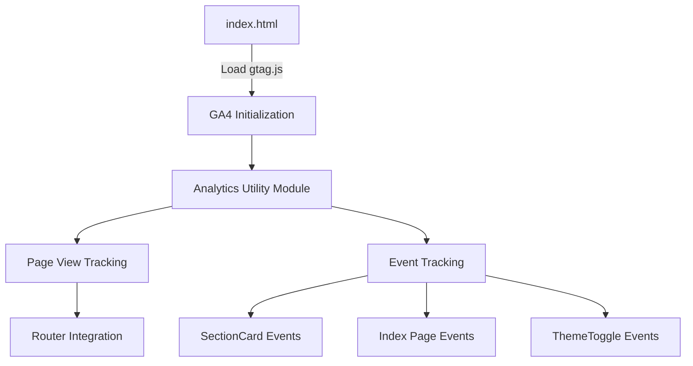

# GA4 Analytics Implementation Plan

## 1. Title

Implement Google Analytics 4 (GA4) tracking for the Security Checklist application

## 2. Short description

Add GA4 analytics to track user engagement with the security checklist, including page views, checklist interactions, progress milestones, and feature usage to inform product decisions and measure adoption.

## 3. Current status

```yaml
owner: TBD
state: proposed
last_updated: 2026-01-09
blockers: []
```

## 4. Objectives

1. Track all page views and user sessions with GA4 measurement ID `G-517LEH65ZW`
2. Capture checklist interaction events (checkbox toggles, section completions)
3. Monitor user progress milestones (25%, 50%, 75%, 100% completion)
4. Track feature engagement (theme toggles, info dialogs, clear actions)
5. Enable data-driven insights for product improvements

## 5. Success criteria

| Name | Metric | Target | Verification |
|------|--------|--------|--------------|
| Script Loading | GA4 script loads without CSP errors | 0 CSP violations | Browser console check in production |
| Page View Tracking | All page views recorded | 100% of sessions | GA4 Realtime report within 30 seconds |
| Event Tracking | Checkbox events fire correctly | All toggle events captured | GA4 DebugView validation |
| Progress Events | Milestone events fire at thresholds | Events at 25%, 50%, 75%, 100% | GA4 Events report |
| Performance Impact | Page load degradation | < 100ms increase | Lighthouse performance audit |
| Bundle Size | Additional JS payload | < 50KB gzipped | Build output analysis (gtag.js ~45KB) |

## 6. Scope

```yaml
in:
  - GA4 gtag.js script installation in index.html
  - CSP policy updates to allow Google Analytics domains
  - Page view tracking for all routes (/, 404)
  - Checkbox toggle event tracking with item/section context
  - Section completion event tracking
  - Progress milestone events (25%, 50%, 75%, 100%)
  - Theme toggle event tracking
  - Clear all button event tracking
  - Environment variable configuration for measurement ID
  - Debug mode for development environment

out:
  - User identification or authentication tracking (no user accounts exist)
  - Enhanced e-commerce tracking (not applicable)
  - Google Tag Manager integration (using gtag directly)
  - Server-side analytics
  - A/B testing framework
  - Custom GA4 dashboard creation
  - Cookie consent banner (deferred to separate privacy compliance work)
```

## 7. Stakeholders & Roles

| Name | Role | Responsibility | Contact |
|------|------|----------------|---------|
| TBD | Project Owner | Approval and acceptance | TBD |
| TBD | Developer | Implementation | TBD |

## 8. High-level timeline & milestones

1. `M1` - Plan approved - TBD - Project Owner
2. `M2` - Environment & CSP setup complete - TBD - Developer
3. `M3` - Basic tracking live (page views) - TBD - Developer
4. `M4` - Event tracking complete - TBD - Developer
5. `M5` - Testing & validation complete - TBD - Developer
6. `M6` - Production deployment - TBD - Developer

## 9. Task list

| ID | Task | Owner | Complexity | Dependencies | Done |
|----|------|-------|------------|--------------|------|
| T-001 | Update CSP policy in index.html to allow Google Analytics domains | TBD | XS | [] | false |
| T-002 | Add GA4 gtag.js script to index.html with measurement ID | TBD | S | [T-001] | false |
| T-003 | Create analytics utility module with initialization and event helpers | TBD | M | [T-002] | false |
| T-004 | Add environment variable for GA4 measurement ID | TBD | XS | [] | false |
| T-005 | Implement page view tracking with router integration | TBD | S | [T-003] | false |
| T-006 | Add checkbox toggle event tracking in SectionCard component | TBD | M | [T-003] | false |
| T-007 | Add section completion event tracking | TBD | S | [T-006] | false |
| T-008 | Add progress milestone event tracking (25%, 50%, 75%, 100%) | TBD | M | [T-003] | false |
| T-009 | Add theme toggle event tracking | TBD | XS | [T-003] | false |
| T-010 | Add clear all button event tracking | TBD | XS | [T-003] | false |
| T-011 | Add debug mode logging for development environment | TBD | S | [T-003] | false |
| T-012 | Test all events in GA4 DebugView | TBD | M | [T-005, T-006, T-007, T-008, T-009, T-010] | false |
| T-013 | Validate tracking in production environment | TBD | S | [T-012] | false |
| T-014 | Document analytics events and parameters | TBD | S | [T-012] | false |

## 10. Risks and mitigations

| ID | Description | Probability | Impact | Mitigation | Owner |
|----|-------------|-------------|--------|------------|-------|
| R-001 | CSP policy blocks GA4 scripts causing tracking failure | Low | High | Test CSP changes in staging before production; use exact Google-recommended domains | TBD |
| R-002 | Performance degradation from analytics scripts | Low | Medium | Use async script loading; lazy-load analytics after initial paint; monitor Lighthouse scores | TBD |
| R-003 | Privacy compliance issues (GDPR, CCPA) | Medium | High | Document data collection practices; plan cookie consent banner as follow-up work; use IP anonymization | TBD |
| R-004 | Event data quality issues (duplicates, missing events) | Medium | Medium | Implement comprehensive testing in DebugView; add console logging in dev mode | TBD |
| R-005 | Measurement ID exposure in client-side code | Low | Low | GA4 measurement IDs are designed to be public; no sensitive data exposure risk | TBD |

## 11. Assumptions

- The GA4 property `G-517LEH65ZW` is already created and configured in Google Analytics
- No server-side tracking is required for this implementation
- Cookie consent requirements will be addressed in a separate compliance initiative
- The existing Vite build pipeline supports the planned implementation without changes
- The `@vercel/analytics` package (currently unused) can be removed or left as-is without conflict

## 12. Implementation approach / Technical narrative

**TL;DR**: Install GA4 via gtag.js script in index.html, create a reusable analytics utility module, and integrate event tracking into existing React components with minimal code changes.

### Architecture Decision: gtag.js vs react-ga4

We recommend using the native **gtag.js** approach over the `react-ga4` library for the following reasons:

1. **Simpler setup**: No additional npm dependencies; gtag.js is loaded via script tag
2. **Official support**: Direct Google implementation ensures compatibility with latest GA4 features
3. **Smaller footprint**: Avoids wrapper library overhead
4. **Flexibility**: Easy to extend with future GA4 features without library updates

### Implementation Flow



### CSP Policy Updates

The Content Security Policy must be updated to allow Google Analytics domains:

```html
<!-- Current CSP -->
script-src 'self' https://cdn.gpteng.co;
connect-src 'self' https:;

<!-- Updated CSP -->
script-src 'self' https://cdn.gpteng.co https://www.googletagmanager.com;
connect-src 'self' https: https://www.google-analytics.com https://analytics.google.com;
```

### Environment Variable Configuration

Add the measurement ID to `.env`:

```env
VITE_GA4_MEASUREMENT_ID=G-517LEH65ZW
```

**Note**: For this implementation, we are hardcoding the measurement ID `G-517LEH65ZW` directly in index.html since:
1. The gtag.js script URL requires the ID at load time
2. GA4 measurement IDs are designed to be public (not secrets)
3. Environment variable approach would require build-time injection which adds complexity

The environment variable above is optional and can be used in the TypeScript code for consistency/documentation purposes.

### GA4 Script Installation

Add the following to `index.html` before the closing `</head>` tag:

```html
<!-- Google Analytics 4 -->
<script async src="https://www.googletagmanager.com/gtag/js?id=G-517LEH65ZW"></script>
<script>
  window.dataLayer = window.dataLayer || [];
  function gtag(){dataLayer.push(arguments);}
  gtag('js', new Date());
  gtag('config', 'G-517LEH65ZW', {
    send_page_view: false // Disable automatic page views for SPA control
  });
</script>
```

### Analytics Utility Module

Create `src/lib/analytics.ts`:

```typescript
// Type definitions for gtag
declare global {
  interface Window {
    gtag: (...args: unknown[]) => void;
    dataLayer: unknown[];
  }
}

const GA_MEASUREMENT_ID = 'G-517LEH65ZW';

export const trackPageView = (path: string, title?: string) => {
  if (typeof window.gtag !== 'function') return;
  
  window.gtag('event', 'page_view', {
    page_path: path,
    page_title: title,
  });
};

export const trackEvent = (
  eventName: string,
  params?: Record<string, string | number | boolean>
) => {
  if (typeof window.gtag !== 'function') return;
  
  if (import.meta.env.DEV) {
    console.log('[Analytics]', eventName, params);
  }
  
  window.gtag('event', eventName, params);
};

// Specific event helpers
export const trackCheckboxToggle = (
  itemId: string,
  sectionId: string,
  checked: boolean
) => {
  trackEvent('checkbox_toggle', {
    item_id: itemId,
    section_id: sectionId,
    checked,
  });
};

export const trackSectionComplete = (sectionId: string, sectionTitle: string) => {
  trackEvent('section_complete', {
    section_id: sectionId,
    section_title: sectionTitle,
  });
};

export const trackProgressMilestone = (percentage: number) => {
  trackEvent('progress_milestone', {
    percentage,
  });
};

export const trackThemeChange = (theme: string) => {
  trackEvent('theme_change', {
    theme,
  });
};

export const trackClearAll = (sectionId: string) => {
  trackEvent('clear_all', {
    section_id: sectionId,
  });
};
```

### Component Integration Points

**SectionCard.tsx** - Checkbox and clear events:
- Call `trackCheckboxToggle()` in `onItemToggle` handler
- Call `trackSectionComplete()` when section reaches 100%
- Call `trackClearAll()` in clear button handler

**Index.tsx** - Progress milestone tracking:
- Track milestone events when overall progress crosses 25%, 50%, 75%, 100%
- Use a ref or state to prevent duplicate milestone events

**ThemeToggle.tsx** - Theme change tracking:
- Call `trackThemeChange()` when theme is toggled

### Page View Tracking

Create a `usePageTracking` hook or add tracking to the router:

```typescript
// In App.tsx or a dedicated hook
import { useEffect } from 'react';
import { useLocation } from 'react-router-dom';
import { trackPageView } from '@/lib/analytics';

const usePageTracking = () => {
  const location = useLocation();
  
  useEffect(() => {
    trackPageView(location.pathname);
  }, [location.pathname]);
};
```

## 13. Testing & validation plan

### Unit Tests
- Test analytics utility functions with mocked `window.gtag`
- Verify event parameters are correctly formatted
- Test graceful handling when gtag is not loaded

### Integration Tests
- Verify page view events fire on route changes
- Test checkbox toggle events with user interaction
- Validate milestone events trigger at correct thresholds

### End-to-End Testing
- Use GA4 DebugView to validate all events in real-time
- Test complete user journey: page load -> checkbox interactions -> completion
- Verify event parameters contain expected values

### Performance Testing
- Run Lighthouse audit before and after implementation
- Measure First Contentful Paint (FCP) impact
- Verify no blocking behavior from analytics scripts

## 14. Deployment plan & roll-back strategy

### Environments
1. **Development** - Local testing with GA4 DebugView
2. **Staging/Preview** - Vercel preview deployments for validation
3. **Production** - Live site deployment

### Deployment Steps
1. Deploy CSP changes and verify no regressions
2. Deploy GA4 script installation
3. Deploy analytics utility module and component integrations
4. Validate in GA4 Realtime reports
5. Monitor for 24 hours for any issues

### Roll-back Criteria
- CSP violations blocking critical functionality
- JavaScript errors from analytics code affecting app functionality
- Significant performance degradation (>200ms page load increase)

### Roll-back Steps
1. Remove or comment out GA4 script tags in index.html
2. Revert CSP policy changes
3. Deploy updated index.html
4. Analytics utility code can remain (no-ops when gtag unavailable)

## 15. Monitoring & observability

### Metrics to Collect
| Metric | Unit | Target |
|--------|------|--------|
| Daily Active Users | count | Baseline + growth tracking |
| Session Duration | seconds | > 60s average |
| Checklist Completion Rate | percentage | Track over time |
| Events per Session | count | 3-10 typical |

### Alerts
- No alerts configured for GA4 (pull-based reporting)
- Monitor browser console errors in development

### Dashboards
- GA4 Realtime overview for immediate validation
- GA4 Events report for interaction analysis
- Custom exploration reports for funnel analysis

## 16. Compliance, security & privacy considerations

### Data Classification
- **User interaction data**: Low sensitivity (anonymous usage patterns)
- **No PII collected**: No user identification or authentication tracking
- **IP anonymization**: Enabled by default in GA4

### Privacy Compliance
- GA4 uses first-party cookies with 2-year expiration
- Consider implementing cookie consent banner (out of scope for this plan)
- Document data collection in privacy policy

### Security Considerations
- GA4 measurement ID is designed to be public (client-side)
- No sensitive data transmitted to analytics
- CSP policy restricts script sources to trusted domains only

## 17. Communication plan

### Notifications
| Event | Audience | Channel | Template |
|-------|----------|---------|----------|
| Plan Approved | Development Team | Slack/Email | "GA4 Analytics plan approved, implementation starting" |
| Implementation Complete | Stakeholders | Slack/Email | "GA4 Analytics live in production, monitoring for 24h" |
| Issues Detected | Development Team | Slack | "GA4 issue detected: [description], investigating" |

## 18. Related documents & links

- [GA4 Implementation Research Findings](./ga4-research-findings.md)
- [Google Analytics 4 Documentation](https://developers.google.com/analytics/devguides/collection/ga4)
- [gtag.js Reference](https://developers.google.com/tag-platform/gtagjs/reference)
- [GA4 Event Parameters Reference](https://developers.google.com/analytics/devguides/collection/ga4/reference/events)
- [Content Security Policy Reference](https://developer.mozilla.org/en-US/docs/Web/HTTP/CSP)

## 19. Appendix

### Event Catalog

| Event Name | Description | Parameters |
|------------|-------------|------------|
| `page_view` | Page navigation | `page_path`, `page_title` |
| `checkbox_toggle` | Checklist item toggled | `item_id`, `section_id`, `checked` |
| `section_complete` | Section reached 100% | `section_id`, `section_title` |
| `progress_milestone` | Overall progress milestone | `percentage` (25, 50, 75, 100) |
| `theme_change` | Theme toggle clicked | `theme` (light, dark) |
| `clear_all` | Clear all button clicked | `section_id` |

### File Changes Summary

| File | Change Type | Description |
|------|-------------|-------------|
| `index.html` | Modify | Update CSP, add GA4 script |
| `src/lib/analytics.ts` | Create | Analytics utility module |
| `src/App.tsx` | Modify | Add page tracking hook |
| `src/components/SectionCard.tsx` | Modify | Add event tracking calls |
| `src/pages/Index.tsx` | Modify | Add milestone tracking |
| `src/components/ThemeToggle.tsx` | Modify | Add theme change tracking |

---

**Checklist before marking plan as ready for review:**

- [x] All minimal required fields are filled
- [x] Dates validated (ISO 8601)
- [x] Complexity assigned to each task (XS/S/M/L/XL)
- [x] At least one test/validation approach is defined
- [x] Security & compliance items are noted
