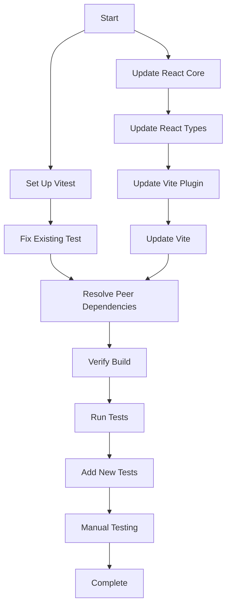

# React 19 Upgrade Plan

## 1. Title

Upgrade lovable-security-checklist from React 18.3.1 to React 19

## 2. Short description

Upgrade the project from React 18.3.1 to React 19.x, including all dependent packages, setting up proper test infrastructure, verifying API compatibility, and ensuring the application functions correctly with modern React patterns.

## 3. Current status

```yaml
owner: TBD
state: proposed
last_updated: 2026-01-08
blockers: []
```

## 4. Objectives

1. Upgrade React and React DOM from 18.3.1 to 19.x stable release
2. Update all React-dependent packages to React 19 compatible versions
3. Update build tooling (Vite) to version supporting React 19
4. Set up proper test infrastructure (Vitest) and fix existing test
5. Verify all existing functionality works correctly after upgrade
6. Add test coverage for core components
7. Ensure zero breaking changes to end-user functionality
8. Document any new React 19 features that could benefit the project

## 5. Success criteria

| Name | Metric | Target | Verification |
|------|--------|--------|--------------|
| Build Success | Build completes without errors | 0 errors | Run `npm run build` successfully |
| Test Infrastructure | Test runner configured and working | Vitest runs | Run `npm run test` successfully |
| Existing Test Pass | SectionCard test passes | 100% | Run test suite |
| No Runtime Errors | Console errors in browser | 0 errors | Manual inspection in Chrome DevTools |
| Core Functionality | Checklist interactions work | All features functional | Manual E2E testing of all user flows |
| Bundle Size | Gzipped bundle size | Within 10% of current | Compare build output sizes |
| Performance | Lighthouse performance score | >= current score | Run Lighthouse audit before/after |
| New Test Coverage | Tests for core components | >= 4 new test files | Count new test files created |

## 6. Scope

```yaml
in:
  - Upgrade react and react-dom to version 19.x
  - Upgrade @types/react and @types/react-dom to version 19.x
  - Upgrade @vitejs/plugin-react-swc to React 19 compatible version
  - Upgrade vite to version 6.x or later as needed for React 19 support
  - Set up Vitest test infrastructure (currently missing)
  - Fix existing SectionCard.test.tsx to work with Vitest
  - Verify and update @testing-library/react if needed
  - Verify react-confetti compatibility with React 19
  - Verify all Radix UI components work with React 19
  - Add tests for core components (ProgressDial, ThemeToggle, GradientBackground, Index page)
  - Update TypeScript types as needed
  - Document any deprecation warnings and address them

out:
  - React Router upgrade from v6 to v7 (separate effort)
  - Adoption of React Server Components (not applicable - client-only app)
  - React Compiler integration (separate evaluation needed)
  - Major refactoring of existing component architecture
  - Adding new features beyond React 19 compatibility
  - Migrating to different state management solutions
  - Testing shadcn/ui components in src/components/ui/ (third-party)
```

## 7. Stakeholders & Roles

| Name | Role | Responsibility | Contact |
|------|------|----------------|---------|
| TBD | Engineering Lead | Delivery and technical decisions | TBD |
| TBD | QA | Manual testing verification | TBD |

## 8. High-level timeline & milestones

1. `M1` - Plan approved - TBD - Engineering Lead
2. `M2` - Dependencies updated, app compiles - TBD - Engineering Lead  
3. `M3` - All existing tests passing - TBD - Engineering Lead
4. `M4` - Manual testing complete - TBD - QA
5. `M5` - Test coverage gaps filled - TBD - Engineering Lead
6. `M6` - Upgrade complete and merged - TBD - Engineering Lead

## 9. Task list

### Phase 0: Test Infrastructure Setup (Complexity: M) - PREREQUISITE

- T-000 | Install Vitest and configure test environment | TBD | complexity: M | deps: [] | done: false
- T-001 | Add test scripts to package.json (test, test:run, test:coverage) | TBD | complexity: XS | deps: [T-000] | done: false
- T-002 | Create vitest.config.ts with jsdom environment | TBD | complexity: S | deps: [T-000] | done: false
- T-003 | Create test setup file (src/test/setup.ts) | TBD | complexity: S | deps: [T-000] | done: false
- T-004 | Fix SectionCard.test.tsx to use Vitest instead of Jest patterns | TBD | complexity: S | deps: [T-002, T-003] | done: false
- T-005 | Verify test infrastructure works with `npm run test` | TBD | complexity: XS | deps: [T-004] | done: false

### Phase 1: Preparation and Research (Complexity: S)

- T-006 | Create backup branch of current working state | TBD | complexity: XS | deps: [] | done: false
- T-007 | Document current bundle sizes and Lighthouse scores for comparison | TBD | complexity: XS | deps: [] | done: false
- T-008 | Verify react-confetti 6.4.0 compatibility with React 19 | TBD | complexity: S | deps: [] | done: false

### Phase 2: Core Dependency Updates (Complexity: M)

- T-009 | Update react and react-dom to ^19.0.0 | TBD | complexity: S | deps: [T-006] | done: false
- T-010 | Update @types/react to ^19.0.0 | TBD | complexity: XS | deps: [T-009] | done: false
- T-011 | Update @types/react-dom to ^19.0.0 | TBD | complexity: XS | deps: [T-009] | done: false
- T-012 | Update @vitejs/plugin-react-swc to ^4.x (React 19 support) | TBD | complexity: S | deps: [T-009] | done: false
- T-013 | Update vite to ^6.x as required | TBD | complexity: M | deps: [T-012] | done: false
- T-014 | Update @testing-library/react if needed for React 19 | TBD | complexity: S | deps: [T-009] | done: false
- T-015 | Run npm install and resolve any peer dependency conflicts | TBD | complexity: M | deps: [T-009, T-010, T-011, T-012, T-013, T-014] | done: false

### Phase 3: Code Compatibility Verification (Complexity: S)

- T-016 | Run TypeScript compilation and fix any type errors | TBD | complexity: M | deps: [T-015] | done: false
- T-017 | Run ESLint and fix any new linting errors | TBD | complexity: S | deps: [T-015] | done: false
- T-018 | Verify application starts with `npm run dev` | TBD | complexity: XS | deps: [T-016, T-017] | done: false
- T-019 | Verify application builds with `npm run build` | TBD | complexity: XS | deps: [T-018] | done: false

### Phase 4: API Migration (if needed) (Complexity: S)

- T-020 | Review and address any forwardRef deprecation warnings | TBD | complexity: S | deps: [T-018] | done: false
- T-021 | Review and update any ref callback patterns if needed | TBD | complexity: S | deps: [T-018] | done: false
- T-022 | Update Context.Provider to Context syntax if desired | TBD | complexity: XS | deps: [T-018] | done: false
- T-023 | Address any other React 19 deprecation warnings | TBD | complexity: M | deps: [T-018] | done: false

### Phase 5: Test Suite Verification (Complexity: M)

- T-024 | Run existing test suite (SectionCard.test.tsx) and fix any failures | TBD | complexity: M | deps: [T-005, T-015] | done: false
- T-025 | Create test utilities file (renderWithProviders) | TBD | complexity: S | deps: [T-024] | done: false
- T-026 | Update any act() usage patterns if needed | TBD | complexity: S | deps: [T-024] | done: false

### Phase 6: Add Test Coverage for Core Components (Complexity: L)

- T-027 | Add tests for ProgressDial component | TBD | complexity: M | deps: [T-025] | done: false
- T-028 | Add tests for ThemeToggle component | TBD | complexity: S | deps: [T-025] | done: false
- T-029 | Add tests for GradientBackground component | TBD | complexity: XS | deps: [T-025] | done: false
- T-030 | Add tests for Index page (integration test) | TBD | complexity: L | deps: [T-025] | done: false
- T-031 | Add tests for use-mobile hook | TBD | complexity: S | deps: [T-025] | done: false
- T-032 | Add tests for checklistService | TBD | complexity: M | deps: [T-025] | done: false

### Phase 7: Manual Testing & Verification (Complexity: M)

- T-033 | Manual test: Checkbox interactions and state persistence | TBD | complexity: S | deps: [T-019] | done: false
- T-034 | Manual test: Progress dial animations and calculations | TBD | complexity: S | deps: [T-019] | done: false
- T-035 | Manual test: Section expand/collapse (if applicable) | TBD | complexity: S | deps: [T-019] | done: false
- T-036 | Manual test: Confetti celebration on completion | TBD | complexity: S | deps: [T-019] | done: false
- T-037 | Manual test: Theme switching (light/dark mode) | TBD | complexity: S | deps: [T-019] | done: false
- T-038 | Manual test: LocalStorage data persistence | TBD | complexity: S | deps: [T-019] | done: false
- T-039 | Manual test: Responsive design on mobile viewports | TBD | complexity: S | deps: [T-019] | done: false
- T-040 | Manual test: Toast notifications | TBD | complexity: XS | deps: [T-019] | done: false

### Phase 8: Performance & Final Verification (Complexity: S)

- T-041 | Compare bundle sizes before/after upgrade | TBD | complexity: S | deps: [T-019] | done: false
- T-042 | Run Lighthouse audit and compare scores | TBD | complexity: S | deps: [T-019] | done: false
- T-043 | Verify no console errors or warnings in production build | TBD | complexity: S | deps: [T-019] | done: false
- T-044 | Run full test suite with coverage report | TBD | complexity: S | deps: [T-027, T-028, T-029, T-030, T-031, T-032] | done: false
- T-045 | Update documentation if needed | TBD | complexity: S | deps: [T-044] | done: false

## 10. Risks and mitigations

| ID | Description | Probability | Impact | Mitigation | Owner |
|----|-------------|-------------|--------|------------|-------|
| R-001 | react-confetti may not be compatible with React 19 | Low | Medium | Test early; if incompatible, find alternative library or fork and fix | TBD |
| R-002 | Vite major version update introduces breaking changes | Medium | Medium | Follow migration guide; pin to specific versions if needed | TBD |
| R-003 | Third-party Radix UI components have React 19 issues | Low | Medium | Radix UI officially supports React 19; update to latest versions | TBD |
| R-004 | TypeScript type incompatibilities between React 18 and 19 | Medium | Low | Use @types/react@19 and fix type errors incrementally | TBD |
| R-005 | Performance regression after upgrade | Low | Medium | Benchmark before/after; React 19 generally improves performance | TBD |
| R-006 | Breaking changes in forwardRef or ref handling | Low | Low | Codebase uses shadcn/ui patterns with forwardRef; apply codemods if needed | TBD |
| R-007 | Test infrastructure setup delays the upgrade | Medium | Medium | Set up Vitest before starting React 19 upgrade; can be done in parallel | TBD |
| R-008 | Existing SectionCard.test.tsx uses Jest patterns | High | Low | Convert to Vitest patterns (vi.fn() instead of jest.fn()) | TBD |
| R-009 | Many Radix UI components need updates for React 19 | Medium | Medium | Update all @radix-ui packages to latest versions during upgrade | TBD |

## 11. Assumptions

- The development team has access to npm and can install updated packages
- The CI/CD pipeline can handle the upgraded dependencies
- No other major refactoring work is planned during this upgrade
- All Radix UI components at their current versions support React 19
- The project will remain a client-side only application (no SSR/RSC)
- React 19 stable (19.0.0+) is the target, not canary/experimental releases
- Test infrastructure (Vitest) setup is a prerequisite that can be done in parallel with the upgrade planning
- The existing SectionCard.test.tsx provides a template for test patterns to follow
- No test coverage currently exists beyond SectionCard (single test file with Jest patterns)

## 12. Implementation approach / Technical narrative

### TL;DR
This upgrade requires two parallel work streams: (1) setting up test infrastructure (Vitest), and (2) upgrading React to v19. The codebase uses modern React patterns, so minimal code changes are expected. Main work involves updating package versions, setting up tests, and verification.

### Current Architecture Assessment

The lovable-security-checklist project is well-positioned for React 19 upgrade:

1. **Modern Root API**: Already using `createRoot` from `react-dom/client` in `src/main.tsx`
2. **No Legacy Patterns**: No usage of deprecated lifecycle methods, string refs, or legacy context
3. **Modern Hooks**: All state management uses `useState`, `useEffect`, `useMemo`, `useCallback`
4. **shadcn/ui Components**: Uses forwardRef pattern extensively in UI components

### Current Test Infrastructure Status

**Critical Gap**: The project has minimal test infrastructure:
- One test file exists: `src/components/SectionCard.test.tsx`
- Uses Jest patterns (`jest.fn()`) but Jest is not configured
- Has `@testing-library/react` and `@testing-library/jest-dom` installed
- Has `@types/jest` installed but no Jest or Vitest configured
- No test scripts in package.json
- No vitest.config.ts or jest.config.js

**Required Setup**:
```bash
# Install Vitest and configure
npm install -D vitest @vitest/coverage-v8 jsdom
```

### React 19 Breaking Changes Assessment

| Breaking Change | Impact on Project | Action Required |
|-----------------|-------------------|-----------------|
| `ReactDOM.render` removed | None - already using `createRoot` | None |
| `ReactDOM.hydrate` removed | None - not using SSR | None |
| `unmountComponentAtNode` removed | None - not used | None |
| `ReactDOM.findDOMNode` removed | None - not used | None |
| Legacy Context removed | None - using modern Context | None |
| String refs removed | None - using `useRef` | None |
| Factory components removed | None - not used | None |
| `propTypes` removed from React | None - using TypeScript | None |
| `defaultProps` for function components deprecated | None - using default parameters | None |
| `forwardRef` may be deprecated | Low - used in shadcn/ui components | Monitor for warnings |

### React 19 New Features (Optional Adoption)

The following React 19 features could be adopted in future iterations:

1. **`use()` hook**: For reading promises and context conditionally
2. **`useActionState`**: For form state management (if forms are added)
3. **`useOptimistic`**: For optimistic UI updates
4. **`ref` as prop**: Simplify forwardRef usage in UI components
5. **`<Context>` as provider**: Cleaner context syntax

These are NOT required for the upgrade and can be adopted incrementally later.

### Dependency Update Strategy



### Package Version Targets

| Package | Current | Target | Notes |
|---------|---------|--------|-------|
| react | 18.3.1 | ^19.0.0 | Core upgrade |
| react-dom | 18.3.1 | ^19.0.0 | Core upgrade |
| @types/react | 18.3.3 | ^19.0.0 | Type definitions |
| @types/react-dom | 18.3.0 | ^19.0.0 | Type definitions |
| @vitejs/plugin-react-swc | 3.5.0 | ^4.0.0 | React 19 JSX transform |
| vite | 5.4.1 | ^6.0.0 | Build tool |
| vitest | N/A | ^2.0.0 | Test runner (NEW) |
| @vitest/coverage-v8 | N/A | ^2.0.0 | Coverage (NEW) |
| jsdom | N/A | ^25.0.0 | Test environment (NEW) |
| @testing-library/react | 16.3.0 | ^16.3.0 | Already compatible |

### Rollback Strategy

If critical issues are discovered:

1. **Immediate rollback**: `git checkout main` and re-deploy
2. **Partial rollback**: Revert specific package versions in package.json
3. **Recovery branch**: The backup branch (T-006) preserves the working state

### Code Changes Expected

Based on codebase analysis, minimal code changes are expected:

1. **Test file update**: Convert `jest.fn()` to `vi.fn()` in SectionCard.test.tsx
2. **Possible type fixes**: Minor TypeScript adjustments for React 19 types
3. **Possible ref callback fixes**: If any implicit returns exist in ref callbacks
4. **New test files**: Add tests for core components

## 13. Testing & validation plan

### Test Infrastructure Setup (Phase 0 - PREREQUISITE)

Before the React 19 upgrade can be validated, test infrastructure must be established:

1. **Install Vitest**: `npm install -D vitest @vitest/coverage-v8 jsdom`
2. **Configure vitest.config.ts**: Set up jsdom environment and path aliases
3. **Create setup file**: `src/test/setup.ts` with testing-library matchers
4. **Add scripts**: `test`, `test:run`, `test:coverage` to package.json
5. **Fix existing test**: Convert `jest.fn()` to `vi.fn()` in SectionCard.test.tsx

### Unit Tests

- **Current Scope**: 1 test file (SectionCard.test.tsx) - needs Jest → Vitest conversion
- **Coverage Target**: Add tests for all core components
- **New Tests Required**:
  - `ProgressDial.test.tsx` - Animation and percentage display
  - `ThemeToggle.test.tsx` - Theme switching
  - `GradientBackground.test.tsx` - Intensity prop handling
  - `Index.test.tsx` - Page integration with providers
  - `use-mobile.test.tsx` - Responsive hook
  - `checklistService.test.ts` - Data fetching and persistence

### Integration Tests

- **Scope**: Page-level tests with providers (BrowserRouter, QueryClient, ThemeProvider)
- **Key Scenarios**:
  - Loading state renders correctly
  - Error state renders correctly
  - Checklist data loads and displays
  - Checkbox toggling updates progress
  - LocalStorage persistence works

### Manual Testing Checklist

| Feature | Test Steps | Expected Result |
|---------|------------|-----------------|
| Checkbox Toggle | Click checkboxes | State updates, progress recalculates |
| Progress Dial | Complete items | Dial animates, shows percentage |
| Completion | Complete all items | Confetti animation plays |
| Theme Toggle | Click theme button | Theme switches with transition |
| Persistence | Refresh page | Checked items are preserved |
| Mobile View | Resize to mobile | Layout adapts responsively |
| Toast Notifications | Trigger error | Toast appears correctly |

### Performance Testing

- **Tool**: Lighthouse CLI or Chrome DevTools
- **Metrics**: Performance score, First Contentful Paint, Time to Interactive
- **Target**: Within 10% of pre-upgrade baseline

## 14. Deployment plan & roll-back strategy

### Environments

1. **Local Development**: First validation
2. **Preview/Staging**: PR preview deployments (Vercel)
3. **Production**: Main branch deployment

### Deployment Steps

1. Complete all tasks and tests on feature branch
2. Create PR for review
3. Verify preview deployment works correctly
4. Merge to main after approval
5. Monitor production deployment
6. Verify production functionality

### Rollback Criteria

Trigger rollback if any of the following occur:
- Application fails to start
- Critical user flows are broken
- Significant performance regression (>20%)
- Console errors affecting functionality

### Rollback Steps

1. Revert merge commit on main branch
2. Deploy previous version
3. Investigate and fix issues on feature branch
4. Re-attempt upgrade with fixes

## 15. Monitoring & observability

### Metrics to Monitor

| Metric | Tool | Target |
|--------|------|--------|
| Console Errors | Browser DevTools | 0 |
| Build Errors | CI Pipeline | 0 |
| Test Failures | Vitest | 0 |
| Bundle Size | Build Output | Within 10% baseline |
| Lighthouse Score | Lighthouse | >= baseline |

### Post-Deployment Checks

- Verify Vercel Analytics continues working
- Check for JavaScript errors in production console
- Validate all user interactions work correctly

## 16. Compliance, security & privacy considerations

### Data Classification

- No sensitive data handling changes
- LocalStorage usage remains unchanged
- No new external data connections

### Security Considerations

- React 19 includes security improvements
- No security-relevant API changes in this project
- Dependencies will be updated to latest secure versions

### Compliance

- N/A - No compliance requirements affected by this upgrade

## 17. Communication plan

### Stakeholder Notifications

| Event | Audience | Channel | Timing |
|-------|----------|---------|--------|
| Plan Approval | Dev Team | PR Review | Before work starts |
| Upgrade Complete | Dev Team | PR Merge | On completion |
| Production Deploy | Stakeholders | Slack/Email | After deploy |

### Issue Escalation

- Minor issues: Fix on feature branch
- Major blockers: Discuss in team standup
- Critical issues: Immediate rollback and incident review

## 18. Related documents & links

- [React 19 Release Blog Post](https://react.dev/blog/2024/12/05/react-19)
- [React 19 Upgrade Guide](https://react.dev/blog/2024/04/25/react-19-upgrade-guide)
- [Vite Migration Guide](https://vite.dev/guide/migration)
- [Vitest Migration Guide](https://vitest.dev/guide/migration)
- [Project Research Document](./react-19-upgrade-research.md)

## 19. Appendix

### A. Current Dependencies (package.json) - ACTUAL

```json
{
  "name": "lovable-vibe-security-checklist",
  "private": true,
  "version": "1.0.0",
  "type": "module",
  "scripts": {
    "dev": "vite",
    "build": "vite build",
    "build:dev": "vite build --mode development",
    "lint": "eslint .",
    "preview": "vite preview"
  },
  "dependencies": {
    "@hookform/resolvers": "^3.9.0",
    "@radix-ui/react-accordion": "^1.2.0",
    "@radix-ui/react-alert-dialog": "^1.1.1",
    "@radix-ui/react-aspect-ratio": "^1.1.0",
    "@radix-ui/react-avatar": "^1.1.0",
    "@radix-ui/react-checkbox": "^1.1.1",
    "@radix-ui/react-collapsible": "^1.1.0",
    "@radix-ui/react-context-menu": "^2.2.1",
    "@radix-ui/react-dialog": "^1.1.2",
    "@radix-ui/react-dropdown-menu": "^2.1.1",
    "@radix-ui/react-hover-card": "^1.1.1",
    "@radix-ui/react-label": "^2.1.0",
    "@radix-ui/react-menubar": "^1.1.1",
    "@radix-ui/react-navigation-menu": "^1.2.0",
    "@radix-ui/react-popover": "^1.1.1",
    "@radix-ui/react-progress": "^1.1.0",
    "@radix-ui/react-radio-group": "^1.2.0",
    "@radix-ui/react-scroll-area": "^1.1.0",
    "@radix-ui/react-select": "^2.1.1",
    "@radix-ui/react-separator": "^1.1.0",
    "@radix-ui/react-slider": "^1.2.0",
    "@radix-ui/react-slot": "^1.1.0",
    "@radix-ui/react-switch": "^1.1.0",
    "@radix-ui/react-tabs": "^1.1.0",
    "@radix-ui/react-toast": "^1.2.1",
    "@radix-ui/react-toggle": "^1.1.0",
    "@radix-ui/react-toggle-group": "^1.1.0",
    "@radix-ui/react-tooltip": "^1.1.4",
    "@tanstack/react-query": "^5.56.2",
    "@testing-library/jest-dom": "^6.6.3",
    "@testing-library/react": "^16.3.0",
    "@types/jest": "^29.5.14",
    "class-variance-authority": "^0.7.1",
    "clsx": "^2.1.1",
    "cmdk": "^1.0.0",
    "date-fns": "^3.6.0",
    "embla-carousel-react": "^8.3.0",
    "input-otp": "^1.2.4",
    "jest-environment-jsdom": "^29.7.0",
    "lucide-react": "^0.462.0",
    "next-themes": "^0.3.0",
    "react": "^18.3.1",
    "react-confetti": "^6.4.0",
    "react-day-picker": "^8.10.1",
    "react-dom": "^18.3.1",
    "react-hook-form": "^7.53.0",
    "react-resizable-panels": "^2.1.3",
    "react-router-dom": "^6.26.2",
    "recharts": "^2.12.7",
    "sonner": "^1.5.0",
    "tailwind-merge": "^2.5.2",
    "tailwindcss-animate": "^1.0.7",
    "vaul": "^0.9.3",
    "zod": "^3.23.8"
  },
  "devDependencies": {
    "@eslint/js": "^9.9.0",
    "@tailwindcss/typography": "^0.5.15",
    "@types/node": "^22.5.5",
    "@types/react": "^18.3.3",
    "@types/react-dom": "^18.3.0",
    "@vitejs/plugin-react-swc": "^3.5.0",
    "autoprefixer": "^10.4.20",
    "eslint": "^9.9.0",
    "eslint-plugin-react-hooks": "^5.1.0-rc.0",
    "eslint-plugin-react-refresh": "^0.4.9",
    "globals": "^15.9.0",
    "lovable-tagger": "^1.1.7",
    "postcss": "^8.4.47",
    "tailwindcss": "^3.4.11",
    "typescript": "^5.5.3",
    "typescript-eslint": "^8.0.1",
    "vite": "^5.4.1"
  }
}
```

**Note**: Test scripts and Vitest are NOT currently configured. This must be set up in Phase 0.

### B. Actual Project Component Structure

| File | Type | Has Tests | Priority for Testing |
|------|------|-----------|---------------------|
| `src/pages/Index.tsx` | Page | No | High (main app logic) |
| `src/components/SectionCard.tsx` | Component | Yes (needs fix) | N/A |
| `src/components/ProgressDial.tsx` | Component | No | High |
| `src/components/ThemeToggle.tsx` | Component | No | Medium |
| `src/components/GradientBackground.tsx` | Component | No | Low |
| `src/hooks/use-mobile.tsx` | Hook | No | Medium |
| `src/services/checklistService.ts` | Service | No | High |
| `src/components/ui/*` | UI Library | No | Out of scope (shadcn/ui) |

### C. React 19 API Changes Reference

| Old API | New API | Status |
|---------|---------|--------|
| `ReactDOM.render()` | `createRoot().render()` | Already migrated |
| `ReactDOM.hydrate()` | `hydrateRoot()` | N/A (no SSR) |
| `forwardRef` | `ref` as prop | Optional migration |
| `<Context.Provider>` | `<Context>` | Optional migration |
| `useFormState` | `useActionState` | N/A (not used) |
| `jest.fn()` | `vi.fn()` | Required for tests |

### D. Test Infrastructure Setup Commands

```bash
# Install Vitest and dependencies
npm install -D vitest @vitest/coverage-v8 jsdom

# Remove Jest dependencies (optional cleanup)
npm uninstall @types/jest jest-environment-jsdom

# Create vitest.config.ts
# Create src/test/setup.ts

# Add to package.json scripts:
# "test": "vitest",
# "test:run": "vitest run",
# "test:coverage": "vitest run --coverage"
```

### E. Sample vitest.config.ts

```typescript
import { defineConfig } from 'vitest/config';
import react from '@vitejs/plugin-react-swc';
import path from 'path';

export default defineConfig({
  plugins: [react()],
  test: {
    environment: 'jsdom',
    globals: true,
    setupFiles: ['./src/test/setup.ts'],
  },
  resolve: {
    alias: {
      '@': path.resolve(__dirname, './src'),
    },
  },
});
```

### F. Sample src/test/setup.ts

```typescript
import '@testing-library/jest-dom/vitest';
```

---

**Plan Version**: 1.1  
**Created**: 2026-01-08  
**Last Updated**: 2026-01-08  
**Revision Notes**: Updated to reflect actual package.json and component structure. Added Phase 0 for test infrastructure setup.
